---
## Front matter
title: "Отчёт по лабораторной работе № 4"
subtitle: "Простейший вариант"
author: "Арфонос Дмитрий"

## Generic otions
lang: ru-RU
toc-title: "Содержание"

## Bibliography
bibliography: bib/cite.bib
csl: pandoc/csl/gost-r-7-0-5-2008-numeric.csl

## Pdf output format
toc: true # Table of contents
toc-depth: 2
lof: true # List of figures
fontsize: 12pt
linestretch: 1.5
papersize: a4
documentclass: scrreprt
## I18n polyglossia
polyglossia-lang:
  name: russian
  options:
	- spelling=modern
	- babelshorthands=true
polyglossia-otherlangs:
  name: english
## I18n babel
babel-lang: russian
babel-otherlangs: english
## Fonts
mainfont: PT Serif
romanfont: PT Serif
sansfont: PT Sans
monofont: PT Mono
mainfontoptions: Ligatures=TeX
romanfontoptions: Ligatures=TeX
sansfontoptions: Ligatures=TeX,Scale=MatchLowercase
monofontoptions: Scale=MatchLowercase,Scale=0.9
## Biblatex
biblatex: true
biblio-style: "gost-numeric"
biblatexoptions:
  - parentracker=true
  - backend=biber
  - hyperref=auto
  - language=auto
  - autolang=other*
  - citestyle=gost-numeric
## Pandoc-crossref LaTeX customization
figureTitle: "Рис."
listingTitle: "Листинг"
lofTitle: "Список иллюстраций"
lolTitle: "Листинги"
## Misc options
indent: true
header-includes:
  - \usepackage{indentfirst}
  - \usepackage{float} # keep figures where there are in the text
  - \floatplacement{figure}{H} # keep figures where there are in the text
---

# Цель работы

Получение навыков правильной работы с репозиториями git в терминале операционной системы Linux.

***

# Выполнение лабораторной работы

 **1**
Устанавливаю  git-flow (рис. [-@fig:001])

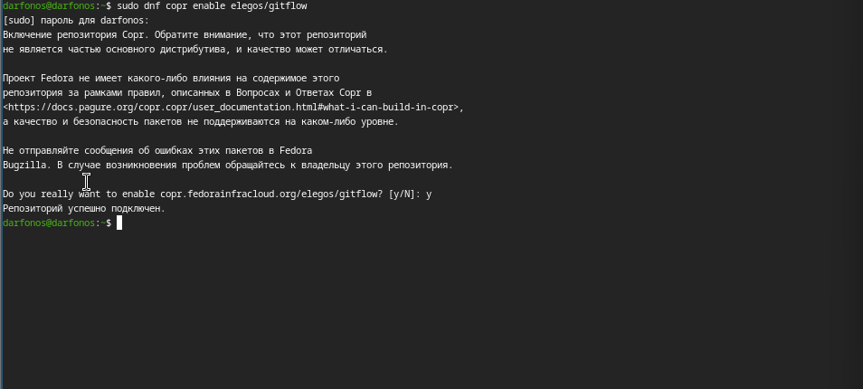{  #fig:001 width=70%  }

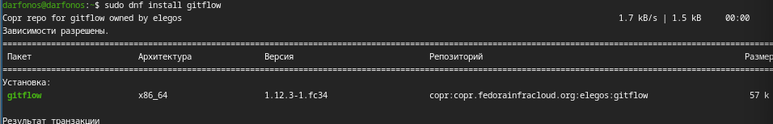{width=70% }

 **2**

Установливаю Node.js (рис. [-@fig:002])

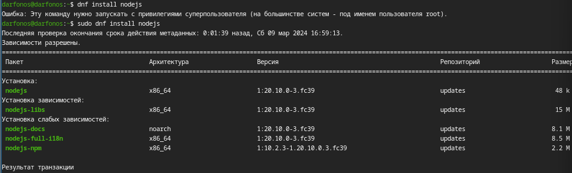{  #fig:002 width=70%  }

 **3**
Установка рограммное обеспечение для семантического версионирования и общепринятых коммитов.(рис. [-@fig:003])

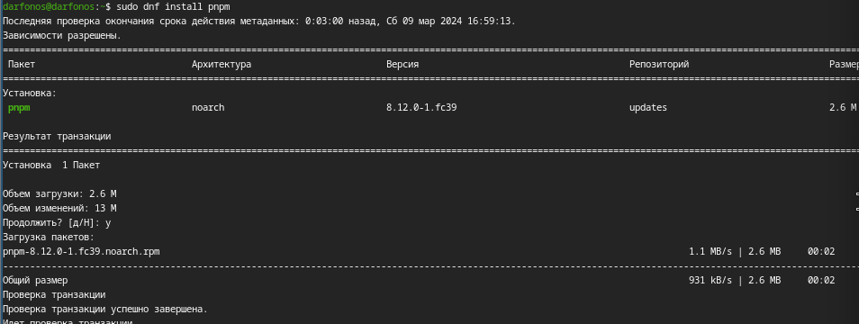{ #fig:003 width=70% }

 **4**
Добавим каталог с исполняемыми файлами, устанавливаемыми yarn, в переменную PATH.(рис. [-@fig:004])

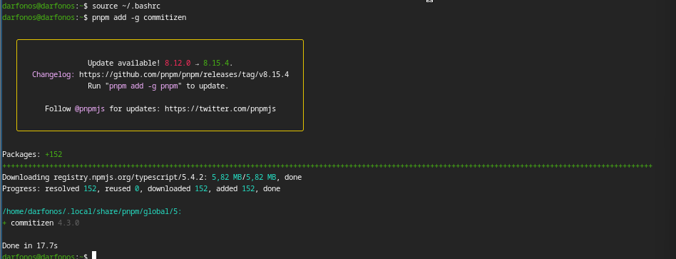{ #fig:004 width=70% }

 **5**
Установка программы для помощи в форматировании коммитов. (рис. [-@fig:005])

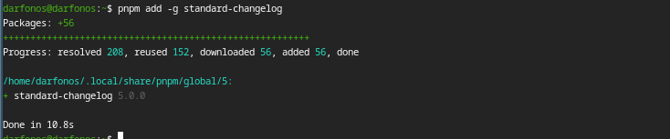{ #fig:005 width=70% }

 **6**
Установка программы для помощи в создании логов.(рис. [-@fig:006])

{ #fig:006 width=70% }

 **7**
Создаю репозиторий на гитхабе(рис. [-@fig:007])

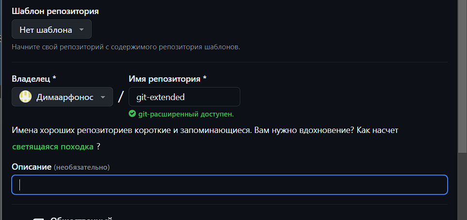{ #fig:007 width=70% }

 **8**
Делаем первый коммит и выкладываем на github:(рис. [-@fig:008])

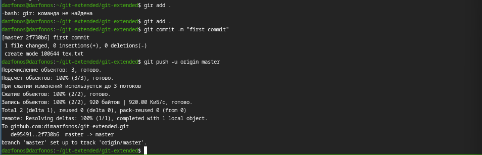{ #fig:008 width=70% }

 **9**

Просмотр конфигурации для пакетов Node.js.(рис. [-@fig:009])

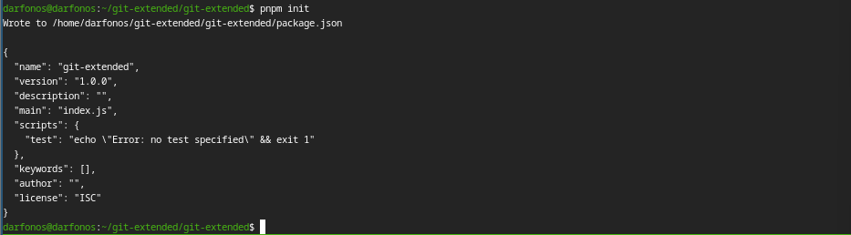{ #fig:009 width=70% }

 **10**

Сконфигурируем файл package.json для формирования коммитов:.(рис. [-@fig:010])

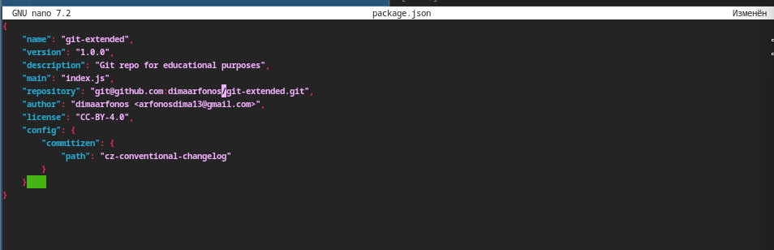{ #fig:010 width=70% }

 **11**

Добавим новые файлы, Выполним коммит:(рис. [-@fig:011])

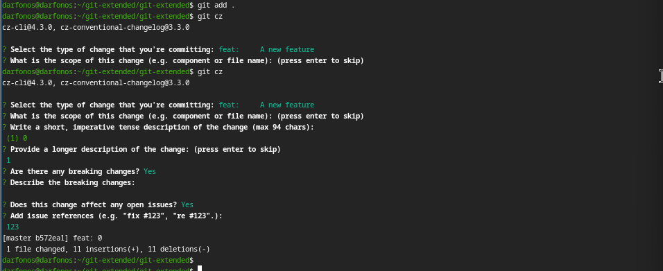{ #fig:011 width=70% }

 **12**

Отправим файлы на github:(рис. [-@fig:012])

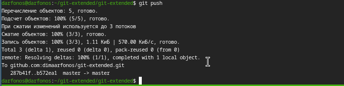{ #fig:012 width=70% }

 **13**

Инициализируем git-flow, Префикс для ярлыков установим в v(рис. [-@fig:013])

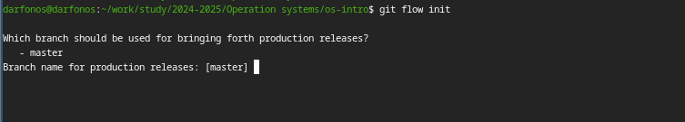{ #fig:013 width=70% }

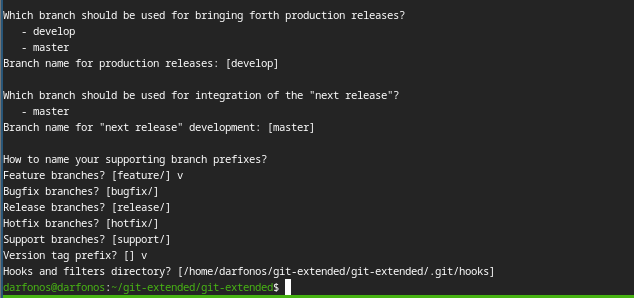{width=70% }

 **14**

Проверяю, что я на ветке develop:(рис. [-@fig:014])

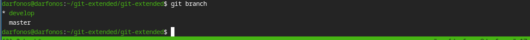{ #fig:014 width=70% }

 **15**

Загружаю весь репозиторий в хранилище :(рис. [-@fig:015])

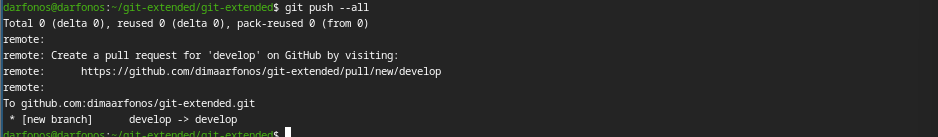{ #fig:015 width=70% }

 **16**

Устанавливаю внешнюю ветку как вышестоящую для этой ветки.(рис. [-@fig:016])

{ #fig:016 width=70% }

 **17**

Создадим релиз с версией 1.0.0(рис. [-@fig:017])

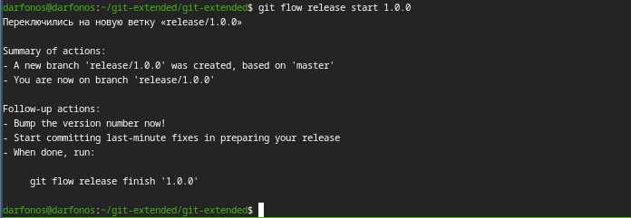{ #fig:017 width=70% }

 **18**

Создадим журнал изменений(рис. [-@fig:018])

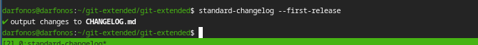{ #fig:018 width=70% }

 **19**

Добавим журнал изменений в индекс.(рис. [-@fig:019])

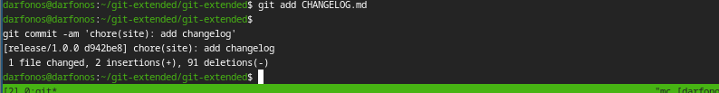{ #fig:019 width=70% }

 **20**

Зальём релизную ветку в основную ветку(рис. [-@fig:020])

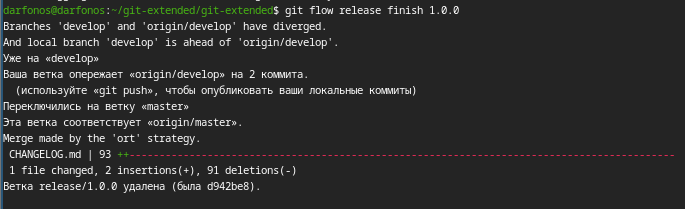{ #fig:020 width=70% }

 **21**

Отправим данные на github (рис. [-@fig:021])

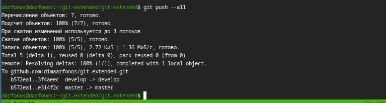{ #fig:021 width=70% }
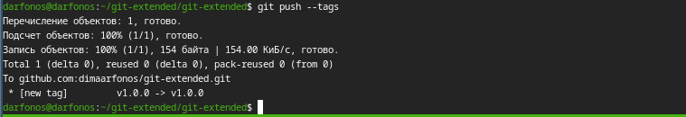{ width=70% }

 **22**

Перезагружаю машину(рис. [-@fig:022])

{ #fig:022 width=70% }

 **23**

Создадим релиз на github. Для этого будем использовать утилиты работы с github:(рис. [-@fig:023])

{ #fig:023 width=70% }

 **24**

Разработка новой функциональности, Создадим ветку для новой функциональности(рис. [-@fig:025])

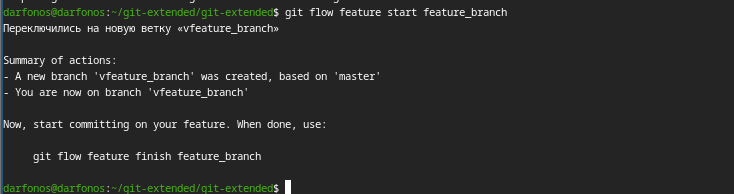{ #fig:025 width=70% }

 **25**

По окончании разработки новой функциональности следующим шагом объединяем ветку feature_branch c develop:(рис. [-@fig:025])

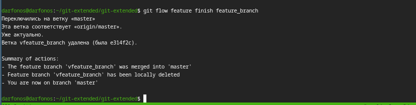{ #fig:025 width=70% }

 **26**

Создаем релиз с версией 1.2.3(рис. [-@fig:026])

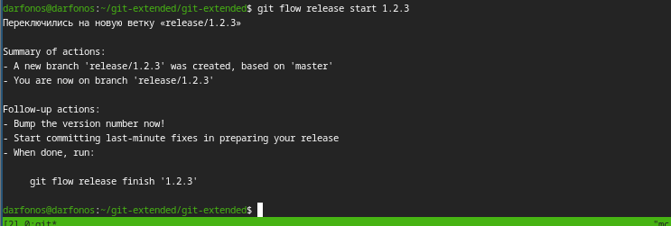{ #fig:026 width=70% }

 **27**

Обновляю номер версии в файле package.json. Установите её в 1.2.3.(рис. [-@fig:027])

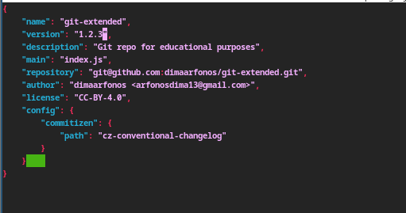 {#fig:27 width=70% }

**28**

Создадим журнал изменений, и добавим журнал изменений в индекс(рис. [-@fig:028])

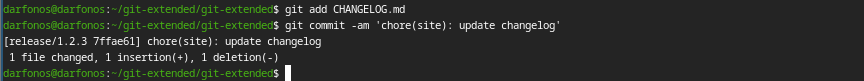{ #fig:028 width=70% }

 **29**

Добавим журнал изменений в индекс(рис. [-@fig:029])

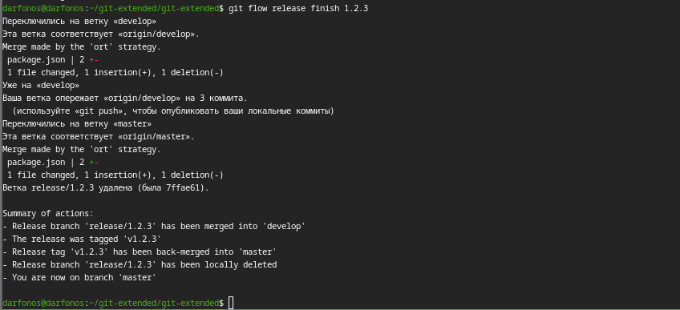{ #fig:029 width=70% }

 **30**

Отправим данные на github(рис. [-@fig:030])

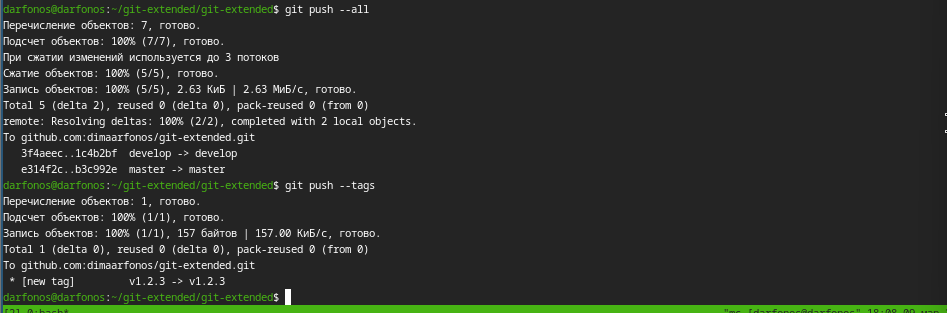{ #fig:030 width=70% }

 **30**

Создадим релиз на github с комментарием из журнала изменений:(рис. [-@fig:031])

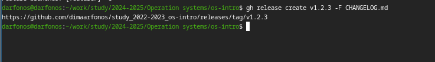{ #fig:031 width=70% }

# Вывод

 Входе лабораторной работы я получил навыки правильной работы с репозиториями git в терминале операционной системы OC Linux Fedora.
