---
## Front matter
lang: ru-RU
title: Структура научной презентации
subtitle: Простейший шаблон
author:
  - Арфонос Дмитрий.
institute:
  - Российский университет дружбы народов, Москва, Россия
date: 9 марта 2024

## i18n babel
babel-lang: russian
babel-otherlangs: english

## Formatting pdf
toc: false
toc-title: Содержание
slide_level: 2
aspectratio: 169
section-titles: true
theme: metropolis
header-includes:
 - \metroset{progressbar=frametitle,sectionpage=progressbar,numbering=fraction}
 - '\makeatletter'
 - '\beamer@ignorenonframefalse'
 - '\makeatother'
---

# Информация

## Докладчик

:::::::::::::: {.columns align=center}
::: {.column width="70%"}

  * Арфонос Дмитрий
  * НММ-03-23
  * студент
  * Российский университет дружбы народов
  * <https://github.com/dimaarfonos/study_2022-2023_os-intro/tree/master/labs>

:::
::: {.column width="30%"}

# 
-  Цель работы

Получение навыков правильной работы с репозиториями Github в среде операционной системы Linux.

:::
::::::::::::::

:::
::: {.column width="30%"}

# Выполнение лабораторной работы

Устанавливаю  Менеджер паролей pass 

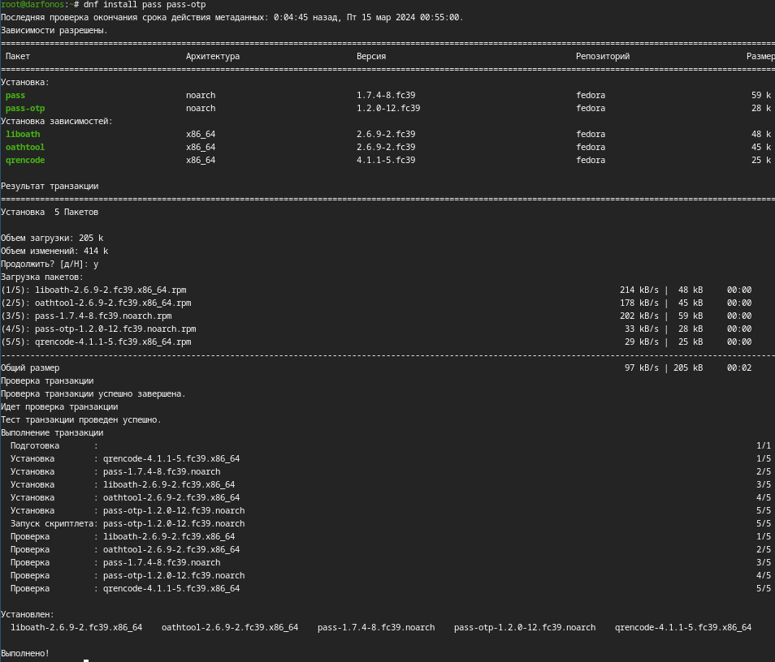

:::
::: {.column width="30%"}

#
Просмотр списка ключей:

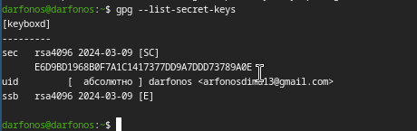

:::
::: {.column width="30%"}

#
Создадим структуру git:

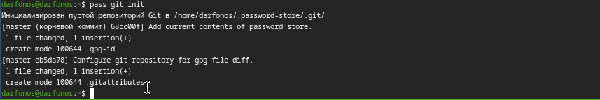

:::
::: {.column width="30%"}

#
задаем адрес репозитория на хостинге и сразу синхронизируем:

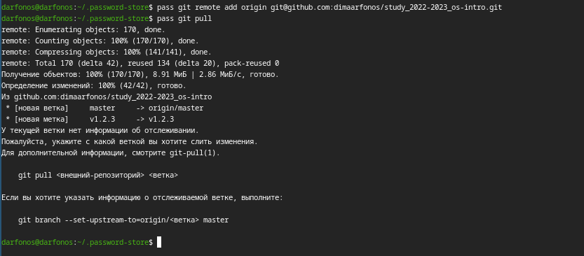

:::
::: {.column width="30%"}

#
Сделаем интерфейс для взаимодействия с броузером (native messaging)

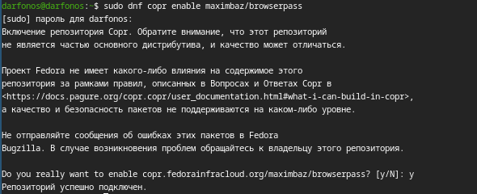

:::
::: {.column width="30%"}

#

Скачивание browserpass.

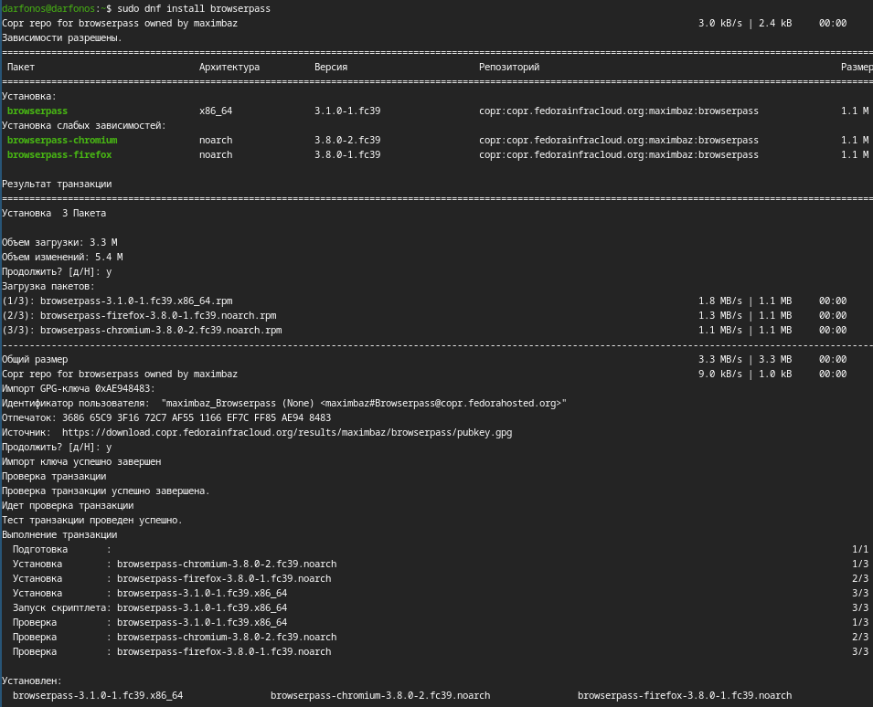

:::
::: {.column width="30%"}

#
Отобразим пароль для указанного имени файла:

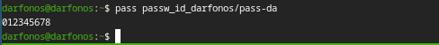

:::
::: {.column width="30%"}

#
Установим дополнительное программное обеспечение:

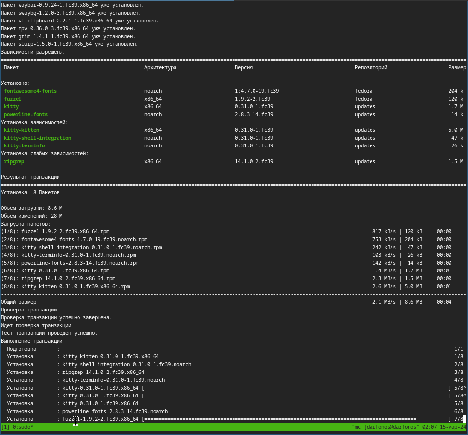

:::
::: {.column width="30%"}

#

Установим шрифты:

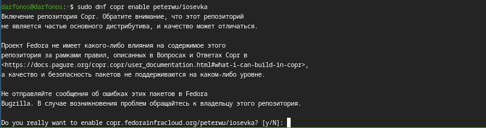

:::
::: {.column width="30%"}

#
Создание собственного репозитория с помощью утилит:

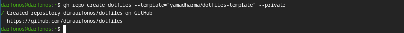

:::
::: {.column width="30%"}

#
Подключение репозитория к своей системе. 

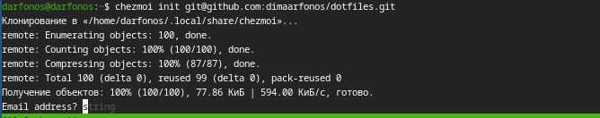

:::
::: {.column width="30%"}

#
Сохраняем изменения, внесённые chezmoi,

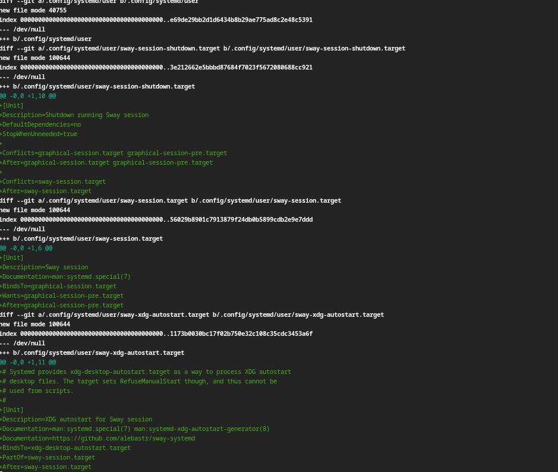

:::
::: {.column width="30%"}

#
Извлечем последние изменения из своего репозитория 
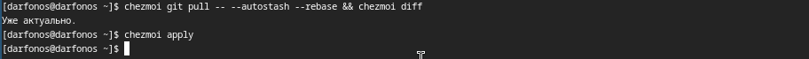

:::
::: {.column width="30%"}

#
Автоматически фиксируем и отправляем изменения в репозиторий

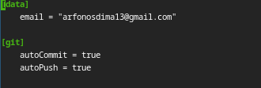

:::
::: {.column width="30%"}

# 
- Вывод

 Входе лабораторной работы я получил навыки правильной работы с репозиториями git с использованием менеджера паролей и автоматической фиксацией и отправкой изменений в репозиторий в терминале операционной системы OC Linux Fedora.

:::
::: {.column width="30%"}