---
## Front matter
title: "Отчёт по лабораторной работе № 5"
subtitle: "Простейший вариант"
author: "Арфонос Дмитрий"

## Generic otions
lang: ru-RU
toc-title: "Содержание"

## Bibliography
bibliography: bib/cite.bib
csl: pandoc/csl/gost-r-7-0-5-2008-numeric.csl

## Pdf output format
toc: true # Table of contents
toc-depth: 2
lof: true # List of figures
fontsize: 12pt
linestretch: 1.5
papersize: a4
documentclass: scrreprt
## I18n polyglossia
polyglossia-lang:
  name: russian
  options:
	- spelling=modern
	- babelshorthands=true
polyglossia-otherlangs:
  name: english
## I18n babel
babel-lang: russian
babel-otherlangs: english
## Fonts
mainfont: PT Serif
romanfont: PT Serif
sansfont: PT Sans
monofont: PT Mono
mainfontoptions: Ligatures=TeX
romanfontoptions: Ligatures=TeX
sansfontoptions: Ligatures=TeX,Scale=MatchLowercase
monofontoptions: Scale=MatchLowercase,Scale=0.9
## Biblatex
biblatex: true
biblio-style: "gost-numeric"
biblatexoptions:
  - parentracker=true
  - backend=biber
  - hyperref=auto
  - language=auto
  - autolang=other*
  - citestyle=gost-numeric
## Pandoc-crossref LaTeX customization
figureTitle: "Рис."
listingTitle: "Листинг"
lofTitle: "Список иллюстраций"
lolTitle: "Листинги"
## Misc options
indent: true
header-includes:
  - \usepackage{indentfirst}
  - \usepackage{float} # keep figures where there are in the text
  - \floatplacement{figure}{H} # keep figures where there are in the text
---

# Цель работы

Получение навыков правильной работы с репозиториями Github в среде операционной системы Linux.

***

# Выполнение лабораторной работы

 **1**
Устанавливаю  Менеджер паролей pass (рис. [-@fig:001])

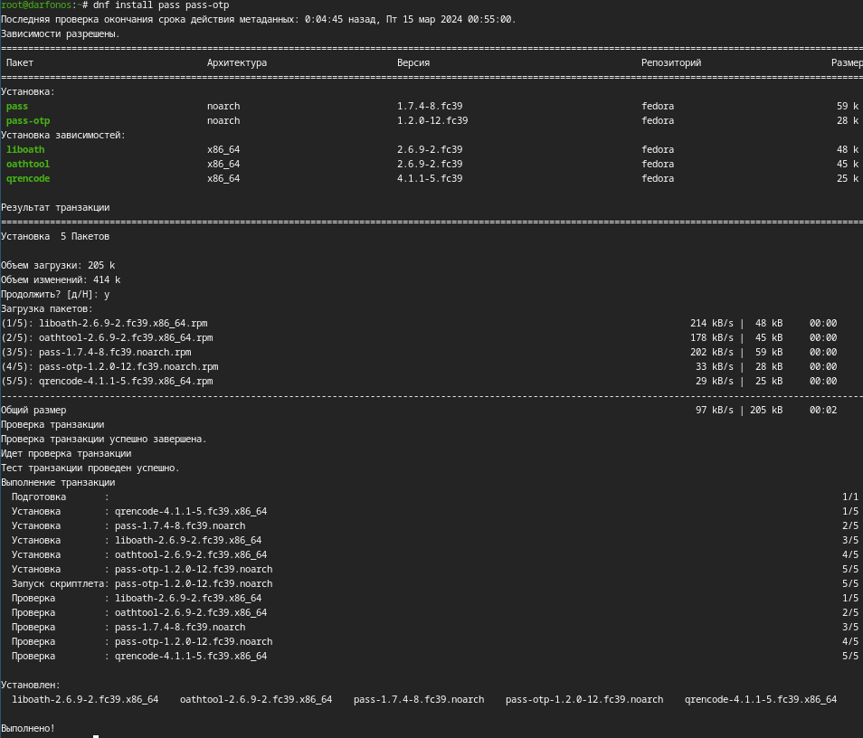{  #fig:001 width=70%  }

 **2**

Установливаю gopass (рис. [-@fig:002])

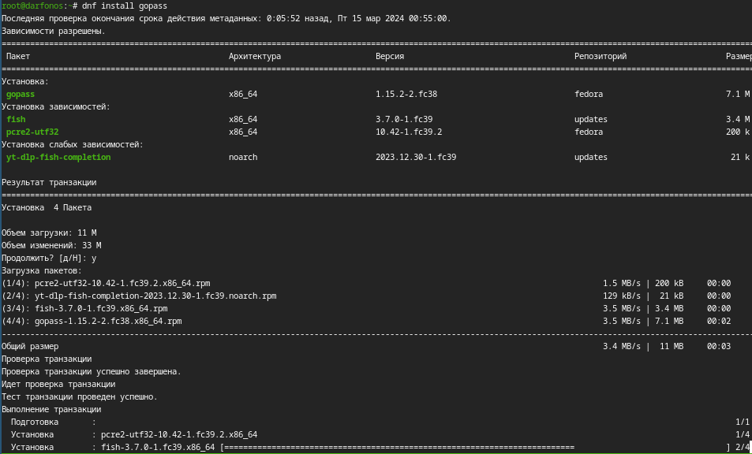{  #fig:002 width=70%  }

 **3**
Просмотр списка ключей:(рис. [-@fig:003])

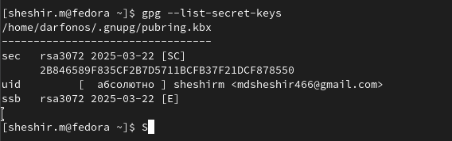{ #fig:003 width=70% }

 **4**
Инициализируем хранилище:(рис. [-@fig:004])

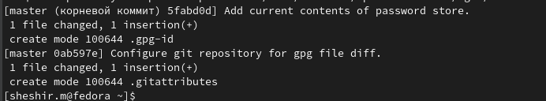{ #fig:004 width=70% }

 **5**
Создадим структуру git: (рис. [-@fig:005])

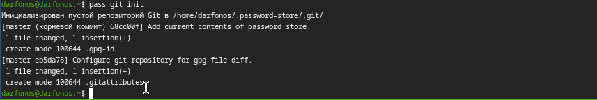{ #fig:005 width=70% }

 **6**
задаем адрес репозитория на хостинге и сразу синхронизируем:(рис. [-@fig:006])

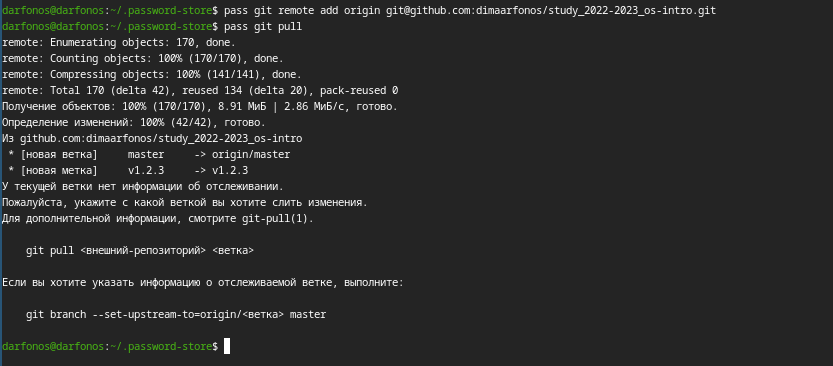{ #fig:006 width=70% }

 **7**
вручную закоммитим и выложим изменения:(рис. [-@fig:007])

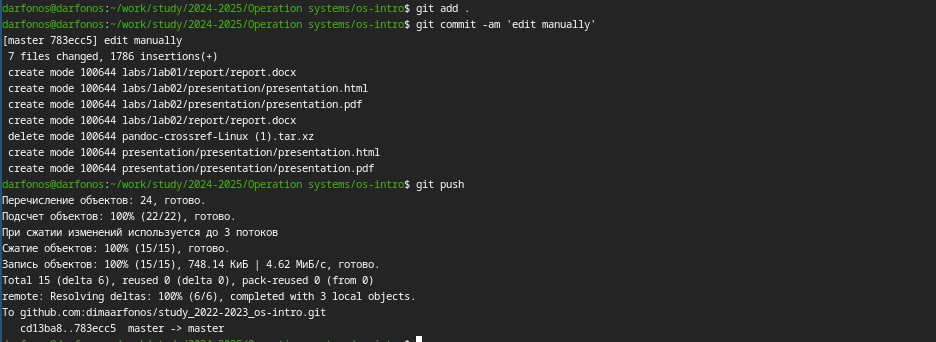{ #fig:007 width=70% }

 **8**
Сделаем интерфейс для взаимодействия с броузером (native messaging)(рис. [-@fig:008])

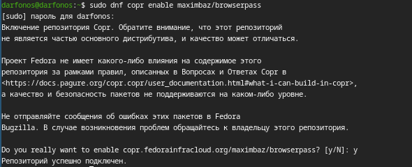{ #fig:008 width=70% }

 **9**

Скачивание browserpass(рис. [-@fig:009])

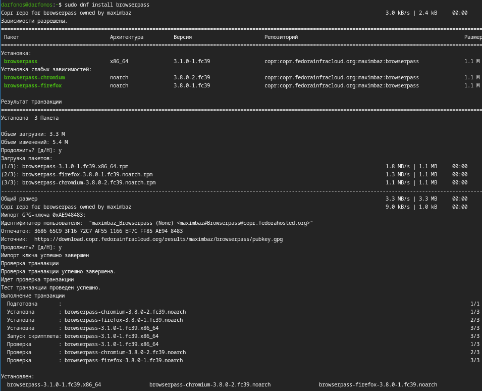{ #fig:009 width=70% }

 **10**

Добавить новый пароль. (рис. [-@fig:010])

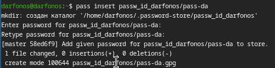{ #fig:010 width=70% }

 **11**

Отобразим пароль для указанного имени файла:(рис. [-@fig:011])

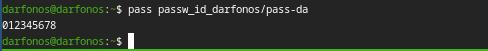{ #fig:011 width=70% }

 **12**

Заменяю существующий пароль(рис. [-@fig:012])

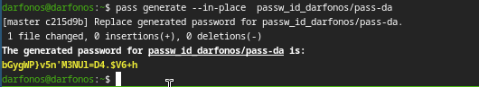{ #fig:012 width=70% }

 **13**

Установим дополнительное программное обеспечение:(рис. [-@fig:013])

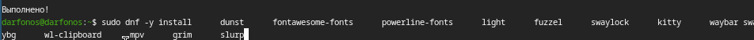{ width=70% }

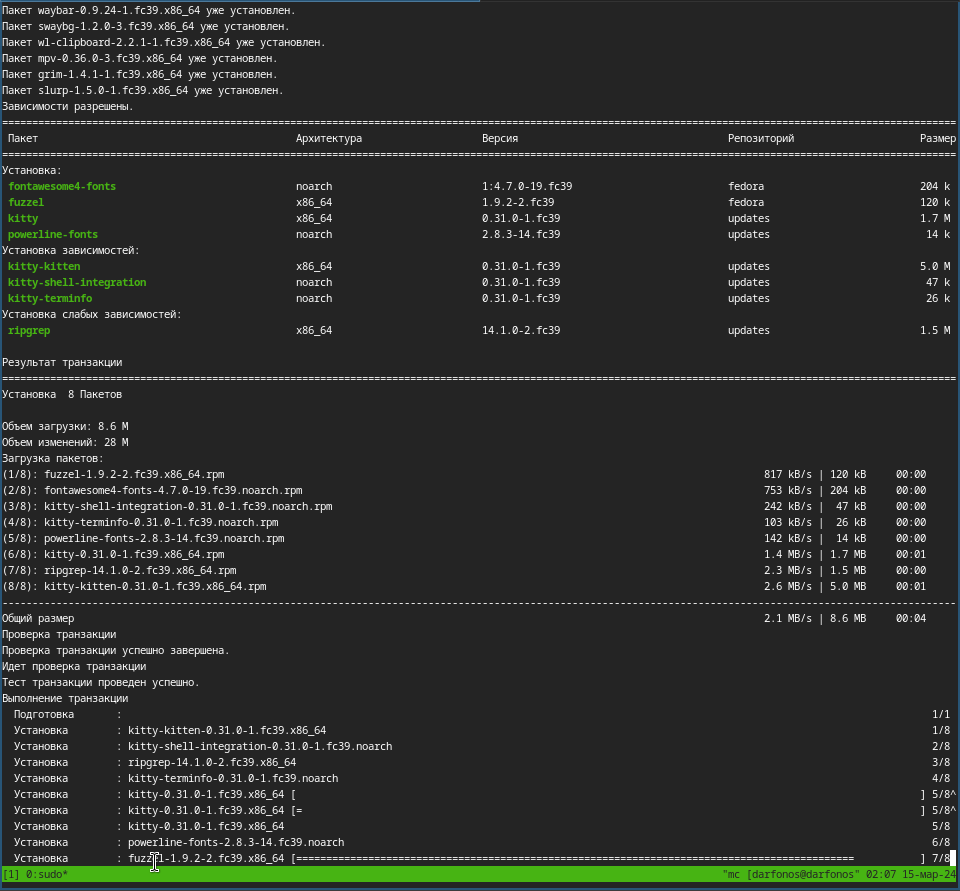{ #fig:013 width=70% }

 **14**

Установим шрифты:(рис. [-@fig:014])

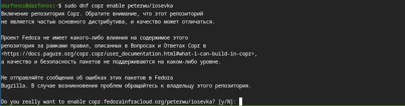{ #fig:014 width=70% }

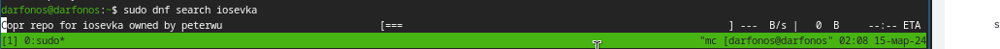{  width=70% }

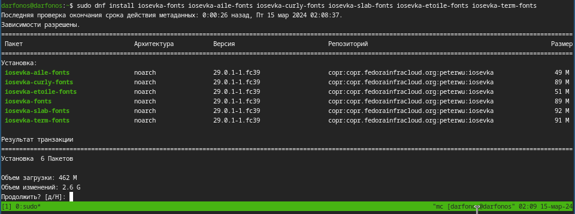{  width=70% }

 **15**

Создание собственного репозитория с помощью утилит:(рис. [-@fig:015])

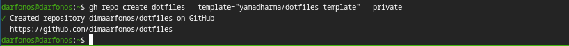{ #fig:015 width=70% }

 **16**

Подключение репозитория к своей системе. (рис. [-@fig:016])

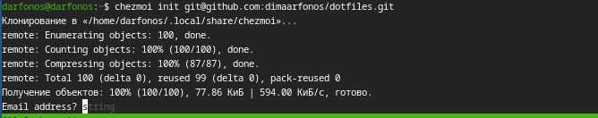{ #fig:016 width=70% }

 **17**

Проверим, какие изменения внесёт chezmoi в домашний каталог(рис. [-@fig:017])

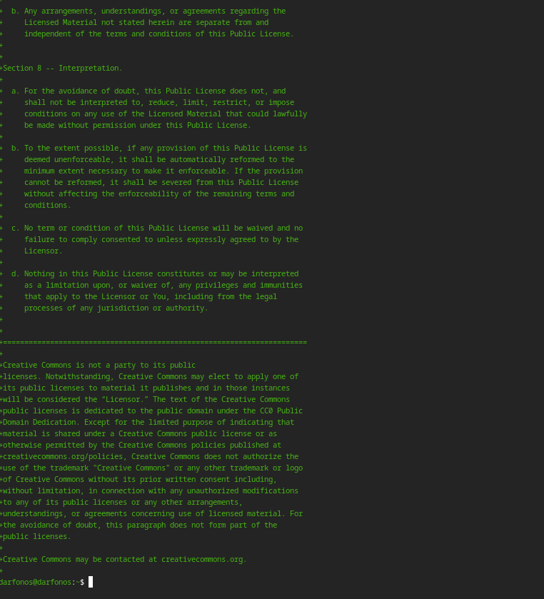{ #fig:017 width=70% }

 **18**

Сохраняем изменения, внесённые chezmoi,(рис. [-@fig:018])

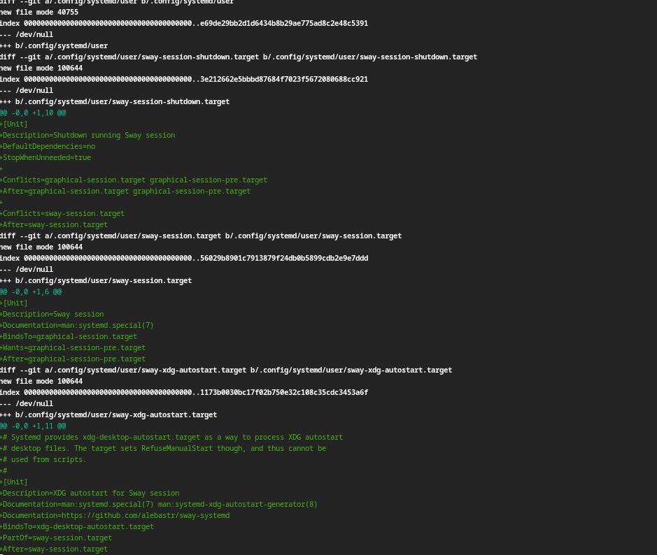{ #fig:018 width=70% }

 **19**

Использование chezmoi на нескольких машинах.(рис. [-@fig:019])

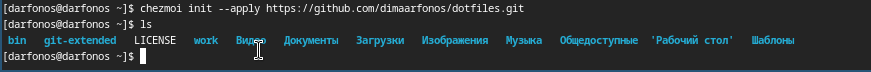{ #fig:019 width=70% }

 **20**

Установим свои dotfiles на новый компьютер с помощью одной команды:(рис. [-@fig:020])

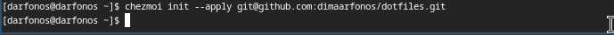{ #fig:020 width=70% }

 **21**

Извлечем изменения из репозитория и применить их одной командой:(рис. [-@fig:021])

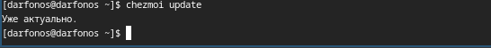{ #fig:021 width=70% }

 **22**

Извлечем последние изменения из своего репозитория (рис. [-@fig:022])

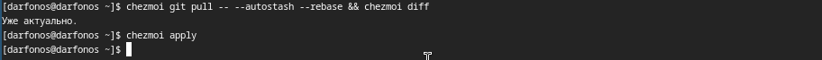{ #fig:022 width=70% }

 **23**

Автоматически фиксируем и отправляем изменения в репозиторий(рис. [-@fig:023])

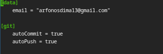{ #fig:023 width=70% }

# Вывод

 Входе лабораторной работы я получил навыки правильной работы с репозиториями git с использованием менеджера паролей и автоматической фиксацией и отправкой изменений в репозиторий в терминале операционной системы OC Linux Fedora.