---
## Front matter
lang: ru-RU
title: Структура научной презентации
subtitle: Лабораторная работа намер 6
author:
  - Арфонос Дмитрий.
institute:
  - Российский университет дружбы народов, Москва, Россия
date: 9 марта 2024

## i18n babel
babel-lang: russian
babel-otherlangs: english

## Formatting pdf
toc: false
toc-title: Содержание
slide_level: 2
aspectratio: 169
section-titles: true
theme: metropolis
header-includes:
 - \metroset{progressbar=frametitle,sectionpage=progressbar,numbering=fraction}
 - '\makeatletter'
 - '\beamer@ignorenonframefalse'
 - '\makeatother'
---

# Информация

## Докладчик

:::::::::::::: {.columns align=center}
::: {.column width="70%"}

  * Арфонос Дмитрий
  * НММ-03-23
  * студент
  * Российский университет дружбы народов
  * <https://github.com/dimaarfonos/study_2022-2023_os-intro/tree/master/labs>

:::
::: {.column width="30%"}

# 
-  Цель работы

:::

Приобретение практических навыков взаимодействия пользователя с системой посредством командной строки.

:::
::::::::::::::

:::
::: {.column width="30%"}

# 
Выполнение лабораторной работы

##
Определите полное имя своего домашнего каталога.

::: incremental

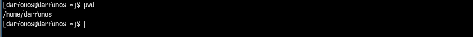{}

::: incremental

#
Перейду в каталог /tmp .

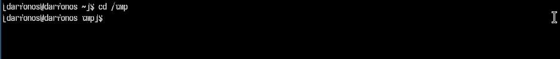{}

::: incremental

##
Вывожу на экран содержимое каталога /tmp. Для этого использую команду ls
.

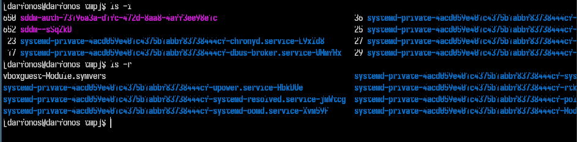

::: incremental

#
Перейду в домашний каталог и вывожу на экран его содержимое. Определяю, кто является владельцем файлов и подкаталогов .

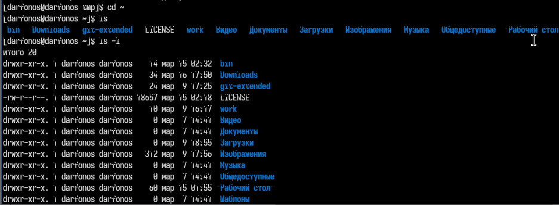

#
В домашнем каталоге создаю новый каталог с именем newdir.

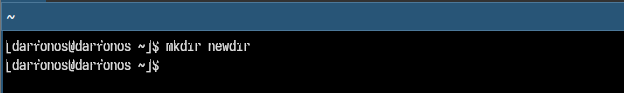

##
В каталоге ~/newdir создаю новый каталог с именем morefun. .

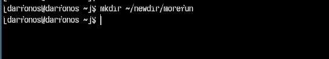

##
В домашнем каталоге создаю одной командой три новых каталога с именами
letters, memos, misk..

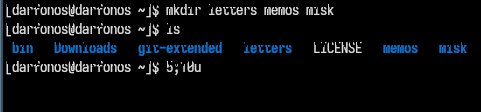

::: incremental

##

Удаляю эти каталоги.

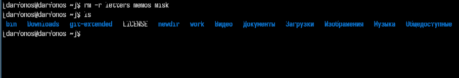

#
С помощью команды man определяю, какую опцию команды ls нужно использовать для просмотра содержимое не только указанного каталога, но и подкаталогов,
входящих в него.

::: incremental

##
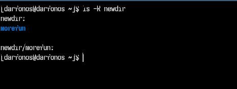{ width=70% }

::: incremental

#
Используя команду man для просмотра описания следующих команд: cd, pwd, mkdir,
rmdir, rm..

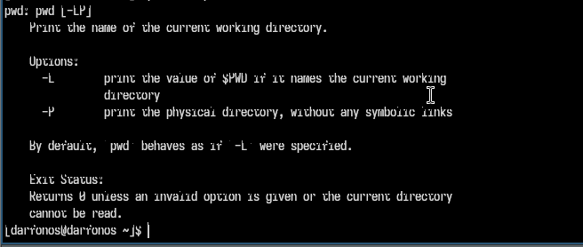

##

::: incremental

pwd -  выводит относительный путь текущего каталога

#
Просмотрю описания следующей команды: mkdir..

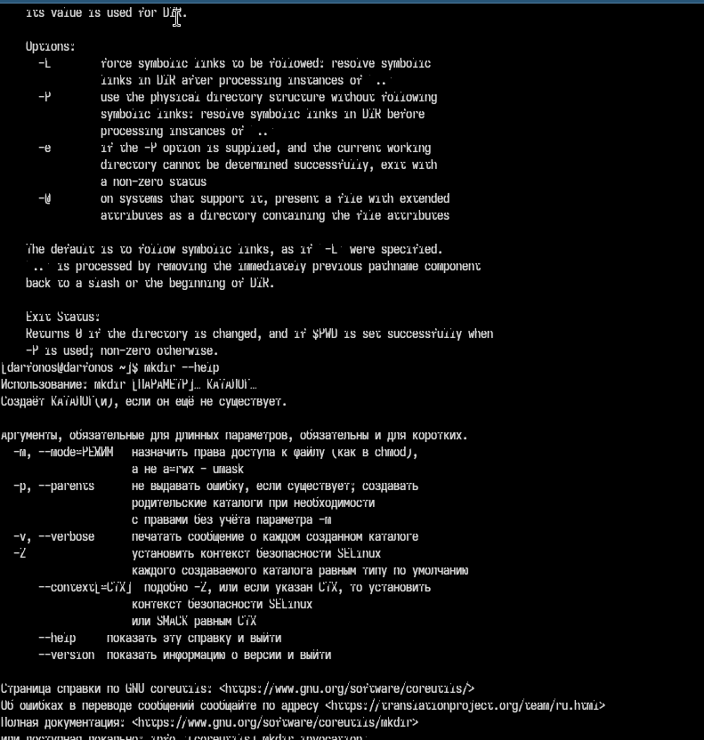

::: incremental

##

::: incremental

Наример опция -р используется для создания каталогов внутри новых каталогов.

#
Используя информацию, полученную при помощи команды history, модифицирую исполнение нескольких команд из буфера команд..

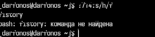

# Вывод
::: incremental

 Входе лабораторной работы я получил навыки взаимодействия пользователя с системой посредством командной строки.

 :::