---
## Front matter
title: "Отчёт по лабораторной работе № 5"
subtitle: "Простейший вариант"
author: "Арфонос Дмитрий"

## Generic otions
lang: ru-RU
toc-title: "Содержание"

## Bibliography
bibliography: bib/cite.bib
csl: pandoc/csl/gost-r-7-0-5-2008-numeric.csl

## Pdf output format
toc: true # Table of contents
toc-depth: 2
lof: true # List of figures
fontsize: 12pt
linestretch: 1.5
papersize: a4
documentclass: scrreprt
## I18n polyglossia
polyglossia-lang:
  name: russian
  options:
	- spelling=modern
	- babelshorthands=true
polyglossia-otherlangs:
  name: english
## I18n babel
babel-lang: russian
babel-otherlangs: english
## Fonts
mainfont: PT Serif
romanfont: PT Serif
sansfont: PT Sans
monofont: PT Mono
mainfontoptions: Ligatures=TeX
romanfontoptions: Ligatures=TeX
sansfontoptions: Ligatures=TeX,Scale=MatchLowercase
monofontoptions: Scale=MatchLowercase,Scale=0.9
## Biblatex
biblatex: true
biblio-style: "gost-numeric"
biblatexoptions:
  - parentracker=true
  - backend=biber
  - hyperref=auto
  - language=auto
  - autolang=other*
  - citestyle=gost-numeric
## Pandoc-crossref LaTeX customization
figureTitle: "Рис."
listingTitle: "Листинг"
lofTitle: "Список иллюстраций"
lolTitle: "Листинги"
## Misc options
indent: true
header-includes:
  - \usepackage{indentfirst}
  - \usepackage{float} # keep figures where there are in the text
  - \floatplacement{figure}{H} # keep figures where there are in the text
---

# Цель работы

Приобретение практических навыков взаимодействия пользователя с системой посредством командной строки.

***

# Выполнение лабораторной работы

 **1**
Определите полное имя своего домашнего каталога(рис. [-@fig:001])

{  #fig:001 width=70%  }

 **2**

Перейду в каталог /tmp (рис. [-@fig:002])

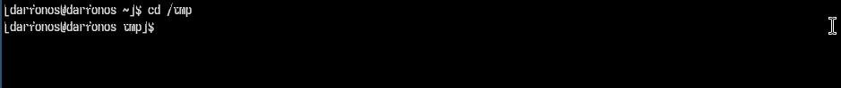{  #fig:002 width=70%  }

 **3**
Вывожу на экран содержимое каталога /tmp. Для этого использую команду ls
(рис. [-@fig:003])

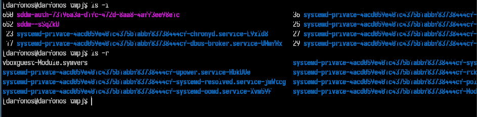{ #fig:003 width=70% }

 **4**
Определию, есть ли в каталоге /var/spool подкаталог с именем cron.(рис. [-@fig:004])

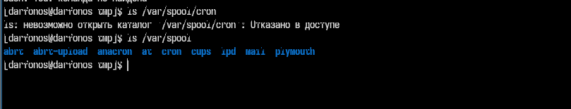{ #fig:004 width=70% }

Да, есть!

 **5**
Перейду в домашний каталог и вывожу на экран его содержимое. Определяю, кто является владельцем файлов и подкаталогов (рис. [-@fig:005])

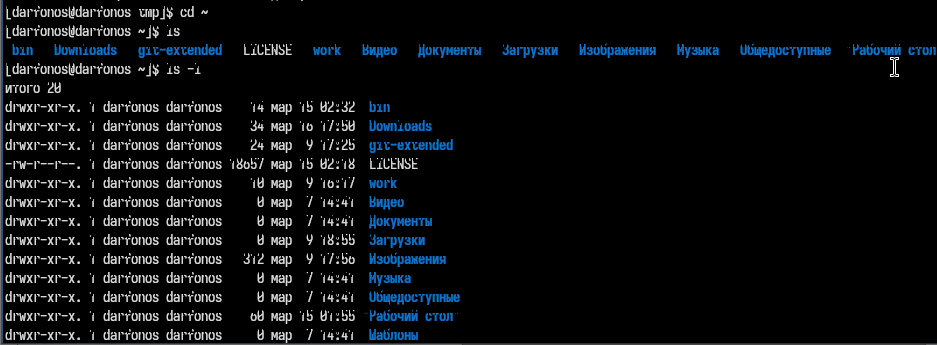{ #fig:005 width=70% }

 **6**
В домашнем каталоге создаю новый каталог с именем newdir(рис. [-@fig:006])

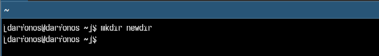{ #fig:006 width=70% }

 **7**
В каталоге ~/newdir создаю новый каталог с именем morefun. (рис. [-@fig:007])

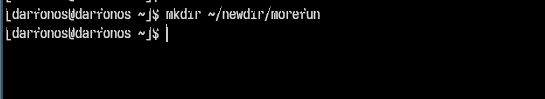{ #fig:007 width=70% }

 **8**
В домашнем каталоге создаю одной командой три новых каталога с именами
letters, memos, misk.(рис. [-@fig:008])

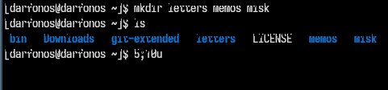{ #fig:008 width=70% }

 **9**

Удаляю эти каталоги(рис. [-@fig:009])

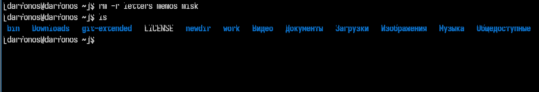{ #fig:009 width=70% }

 **10**

Попробую удалить ранее созданный каталог ~/newdir командой rm. (рис. [-@fig:010])

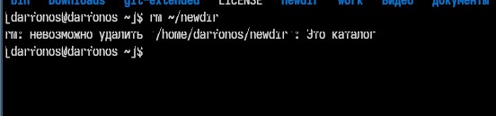{ #fig:010 width=70% }

- каталог не удаляется т.к. нужно использовать специальный аргумент.

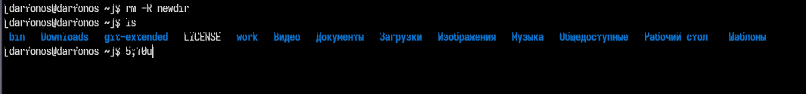{ width=70% }

 **11**

С помощью команды man определяю, какую опцию команды ls нужно использовать для просмотра содержимое не только указанного каталога, но и подкаталогов,
входящих в него(рис. [-@fig:011])

{ #fig:011 width=70% }

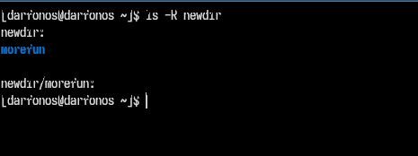{ width=70% }

 **12**

С помощью команды man определяю набор опций команды ls, позволяющий отсортировать по времени последнего изменения выводимый список содержимого каталога
с развёрнутым описанием файлов.(рис. [-@fig:012])

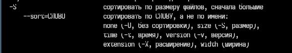{ #fig:012 width=70% }

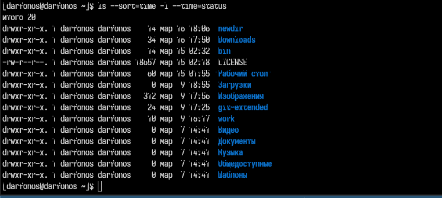{ width=70% }

 **13**

Используя команду man для просмотра описания следующих команд: cd, pwd, mkdir,
rmdir, rm.(рис. [-@fig:013])

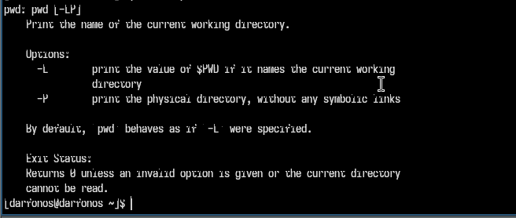{ #fig:013 width=70% }

pwd -  выводит относительный путь текущего каталога

 **14**

Просмотрю описания следующих команд: rm.(рис. [-@fig:014])

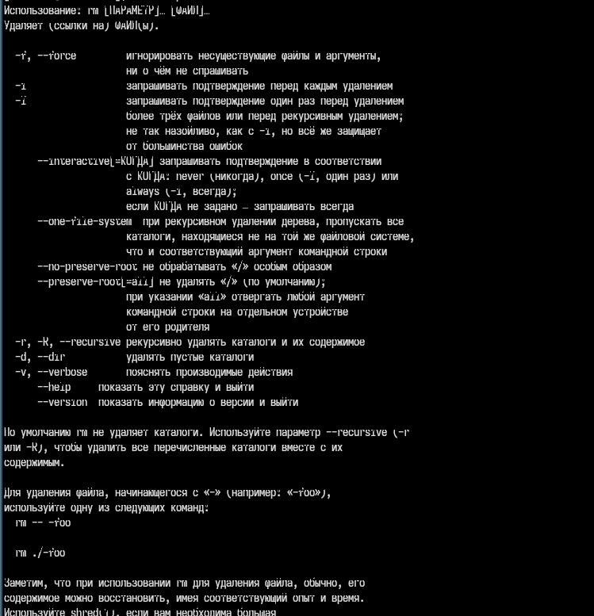{ #fig:014 width=70% }

Например опция -R используется для удаления каталогов.

 **15**

Просмотрю описания следующей команды: cd.(рис. [-@fig:015])

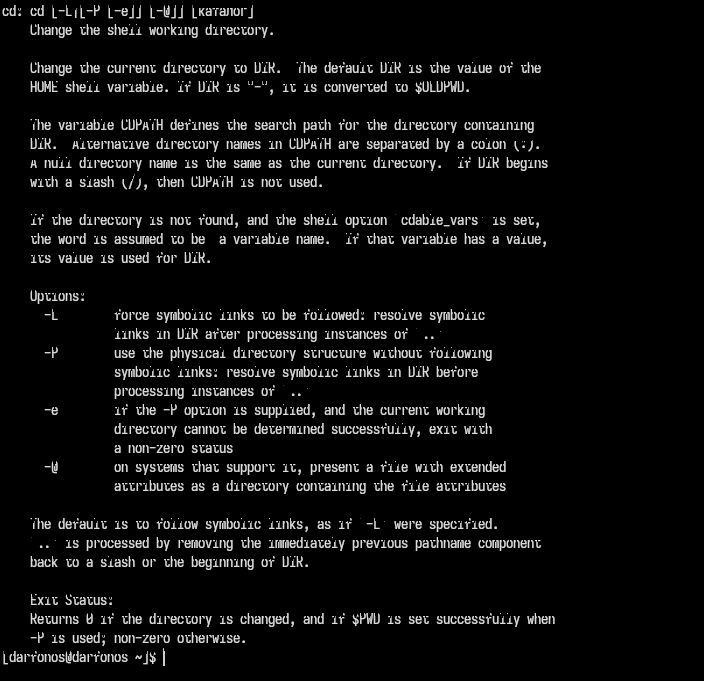{ #fig:015 width=70% }

cd - используется для перемещения между каталогами

 **16**

Просмотрю описания следующей команды: mkdir.(рис. [-@fig:017])

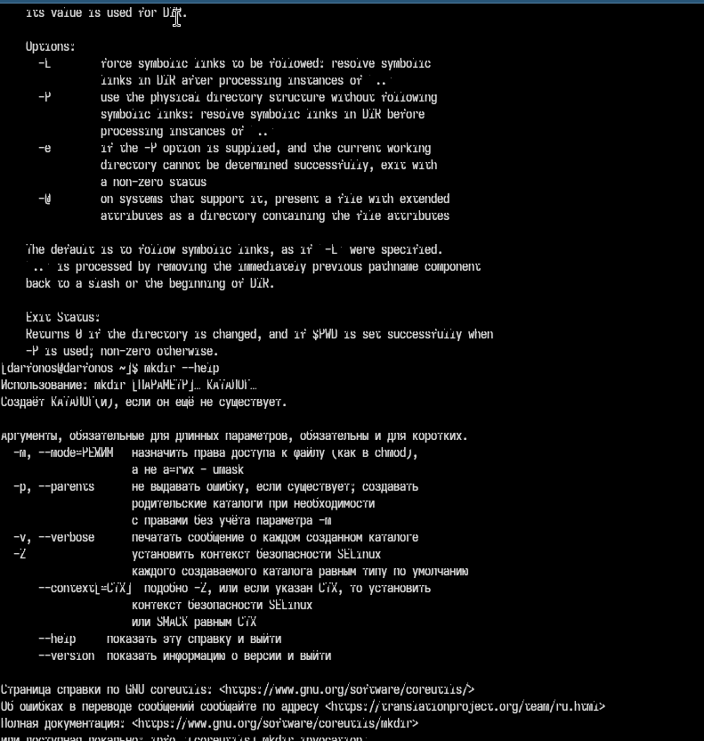{ #fig:017 width=70% }

Наример опция -р используется для создания каталогов внутри новых каталогов.

 **18**

Используя информацию, полученную при помощи команды history, модифицирую исполнение нескольких команд из буфера команд.(рис. [-@fig:018])

{ #fig:018 width=70% }

# Вывод

 Входе лабораторной работы я получил навыки взаимодействия пользователя с системой посредством командной строки.