---
## Front matter
title: "Отчёт по лабораторной работе № 7"
subtitle: "Простейший вариант"
author: "Арфонос Дмитрий"

## Generic otions
lang: ru-RU
toc-title: "Содержание"

## Bibliography
bibliography: bib/cite.bib
csl: pandoc/csl/gost-r-7-0-5-2008-numeric.csl

## Pdf output format
toc: true # Table of contents
toc-depth: 2
lof: true # List of figures
fontsize: 12pt
linestretch: 1.5
papersize: a4
documentclass: scrreprt
## I18n polyglossia
polyglossia-lang:
  name: russian
  options:
	- spelling=modern
	- babelshorthands=true
polyglossia-otherlangs:
  name: english
## I18n babel
babel-lang: russian
babel-otherlangs: english
## Fonts
mainfont: PT Serif
romanfont: PT Serif
sansfont: PT Sans
monofont: PT Mono
mainfontoptions: Ligatures=TeX
romanfontoptions: Ligatures=TeX
sansfontoptions: Ligatures=TeX,Scale=MatchLowercase
monofontoptions: Scale=MatchLowercase,Scale=0.9
## Biblatex
biblatex: true
biblio-style: "gost-numeric"
biblatexoptions:
  - parentracker=true
  - backend=biber
  - hyperref=auto
  - language=auto
  - autolang=other*
  - citestyle=gost-numeric
## Pandoc-crossref LaTeX customization
figureTitle: "Рис."
listingTitle: "Листинг"
lofTitle: "Список иллюстраций"
lolTitle: "Листинги"
## Misc options
indent: true
header-includes:
  - \usepackage{indentfirst}
  - \usepackage{float} # keep figures where there are in the text
  - \floatplacement{figure}{H} # keep figures where there are in the text
---

# Цель работы

Ознакомление с файловой системой Linux, её структурой, именами и содержанием
каталогов. Приобретение практических навыков по применению команд для работы
с файлами и каталогами, по управлению процессами (и работами), по проверке использования диска и обслуживанию файловой системы.

***

# Выполнение лабораторной работы

 **1**
Создаю текстовой файл с командой touch и смотрю содержимое. (рис. [-@fig:001])

{  #fig:001 width=70%  }

 **2**

Для просмотра файлов постранично удобнее использовать команду less(рис. [-@fig:002])

{  #fig:002 width=70%  }

 **3**
Команда head выводит по умолчанию первые 10 строк файла
(рис. [-@fig:003])

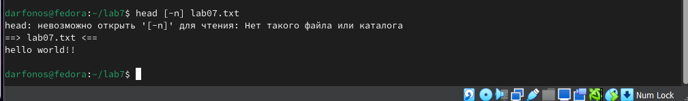{ #fig:003 width=70% }

 **4**
Команда tail выводит умолчанию 10 последних строк файла.(рис. [-@fig:004])

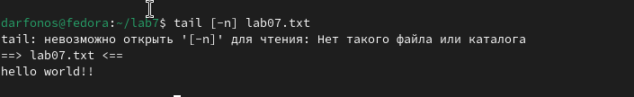{ #fig:004 width=70% }

Да, есть!

 **5**
Скопирую файл /usr/include/sys/io.h в домашний каталог и назову его
equipment. (рис. [-@fig:005])

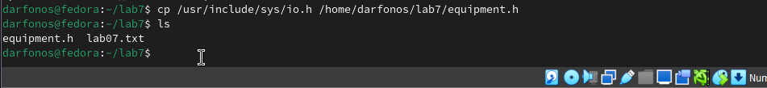{ #fig:005 width=70% }

 **6**
В домашнем каталоге создаю директорию   ~/ski.plases и Перемещу файл equipment в этот каталог(рис. [-@fig:006])

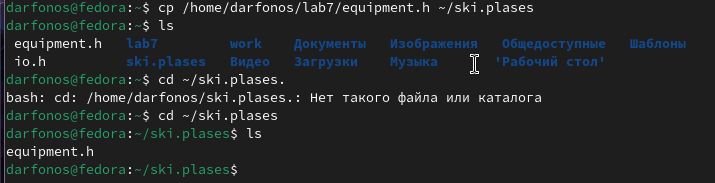{ #fig:006 width=70% }

 **7**
Переименовываю файл ~/ski.plases/equipment в ~/ski.plases/equiplist.(рис. [-@fig:007])

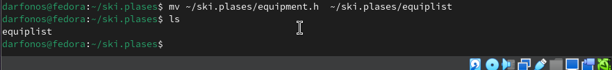{ #fig:007 width=70% }

 **8**
Создаю в домашнем каталоге файл abc1 и скопирую его в каталог
~/ski.plases, назову его equiplist2.(рис. [-@fig:008])

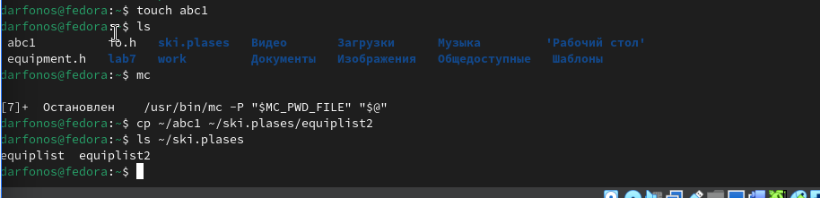{ #fig:008 width=70% }

 **9**

Создаю каталог с именем equipment в каталоге ~/ski.plases.(рис. [-@fig:009])

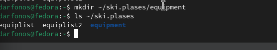{ #fig:009 width=70% }

 **10**

Перемещу файлы ~/ski.plases/equiplist и equiplist2 в каталог
~/ski.plases/equipment.(рис. [-@fig:010])

{ #fig:010 width=70% }

 **11**

 Создал и переместите каталог ~/newdir в каталог ~/ski.plases назовиву его plans.(рис. [-@fig:011])

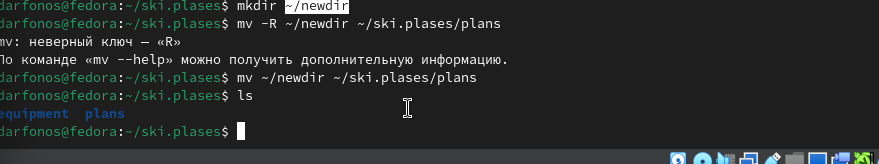{ #fig:011 width=70% }

 **12**

Создаю необходимые катологи и файлы для определения опций chmod(рис. [-@fig:012])

{ #fig:012 width=70% }

 **13**

Используя команду chmod изменяю права пользователей по образцу drwxr--r-- к папке australia.(рис. [-@fig:013])

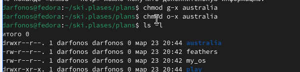{ #fig:013 width=70% }

 **14**

Используя команду chmod изменяю права пользователей по образцу drwx--x--x к папке play(рис. [-@fig:014])

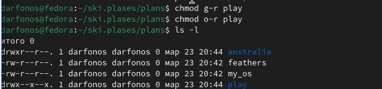{ #fig:014 width=70% }

 **15**

Используя команду chmod изменяю права пользователей по образцу -r-xr--r--  к файлу my_os(рис. [-@fig:015])

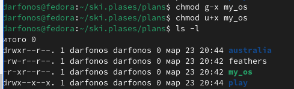{ #fig:015 width=70% }

 **16**

Используя команду chmod изменяю права пользователей по образцу -r-xr--r--  к файлу feathers(рис. [-@fig:017])

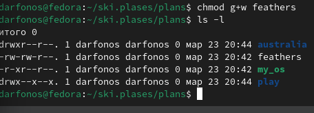{ #fig:017 width=70% }

 **18**

Просмотрю содержимое файла /etc/password.
(рис. [-@fig:018])

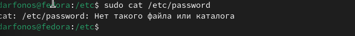{ #fig:018 width=70% }

- нет такого файла

**19**

Скопирую файл ~/feathers в файл ~/file.old.(рис. [-@fig:019])

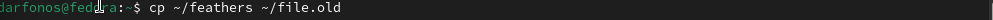{ #fig:019 width=70% }

 **20**

Перемещу файл ~/file.old в каталог ~/play.(рис. [-@fig:020])

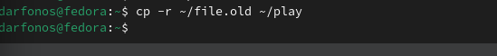{ #fig:020 width=70% }

 **21**

Перемещу каталог ~/fun в каталог ~/play и назову его games.(рис. [-@fig:021])

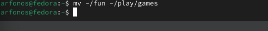{ #fig:021 width=70% }

 **22**

Лишаю владельца файла ~/feathers права на чтение. (рис. [-@fig:022])

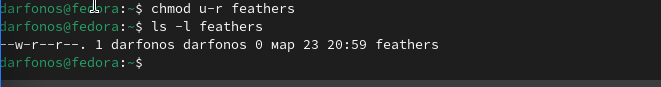{ #fig:022 width=70% }

**23**

Если вы попытаюсь просмотреть файл ~/feathers командой
cat то откажут в доступе. (рис. [-@fig:023])

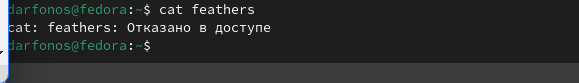{ #fig:023 width=70% }

- если попытаеюсь скопировать файл ~/feathers, то также будет отказано в доступе.

 **24**

Даю владельцу файла ~/feathers право на чтение.(рис. [-@fig:024])

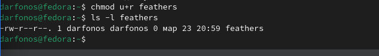{ #fig:024 width=70% }

 **25**

Лишаю владельца каталога ~/play права на выполнение.(рис. [-@fig:025])

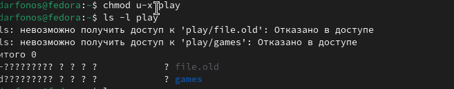{ #fig:025 width=70% }

 **26**

Пытаюсь Перейти в каталог ~/play, и мне отказывают в доступе.(рис. [-@fig:026])

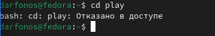{ #fig:026 width=70% }

**27**

Даю владельцу каталога ~/play право на выполнение. (рис. [-@fig:027])

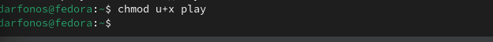{ #fig:027 width=70% }

**28**

Прочитаю man по команде mount (рис. [-@fig:028])

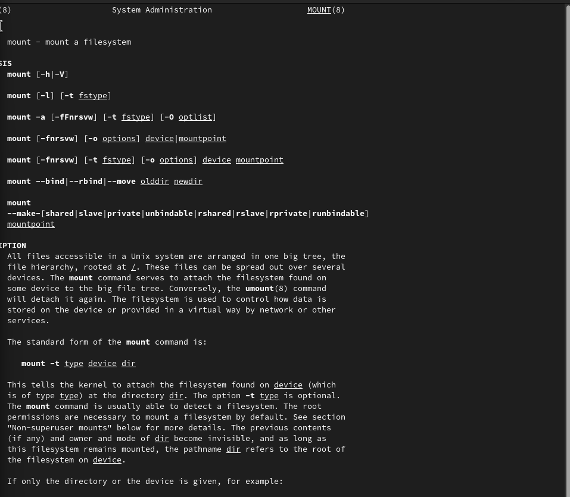{ #fig:028 width=70% }

  - Для просмотра используемых в операционной системе файловых систем можно воспользоваться командой mount без параметров. В результате её применения можно получить примерно следующее:

 **29**

Прочитаю man по команде fsck(рис. [-@fig:029])

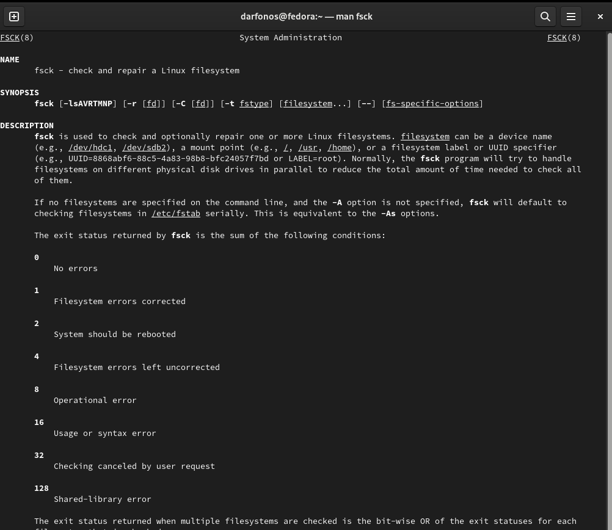{ #fig:029 width=70% }

- С помощью команды fsck можно проверить (а в ряде случаев восстановить) целостность файловой системы:

 **30**

Прочитаю man по команде mkfs(рис. [-@fig:030])

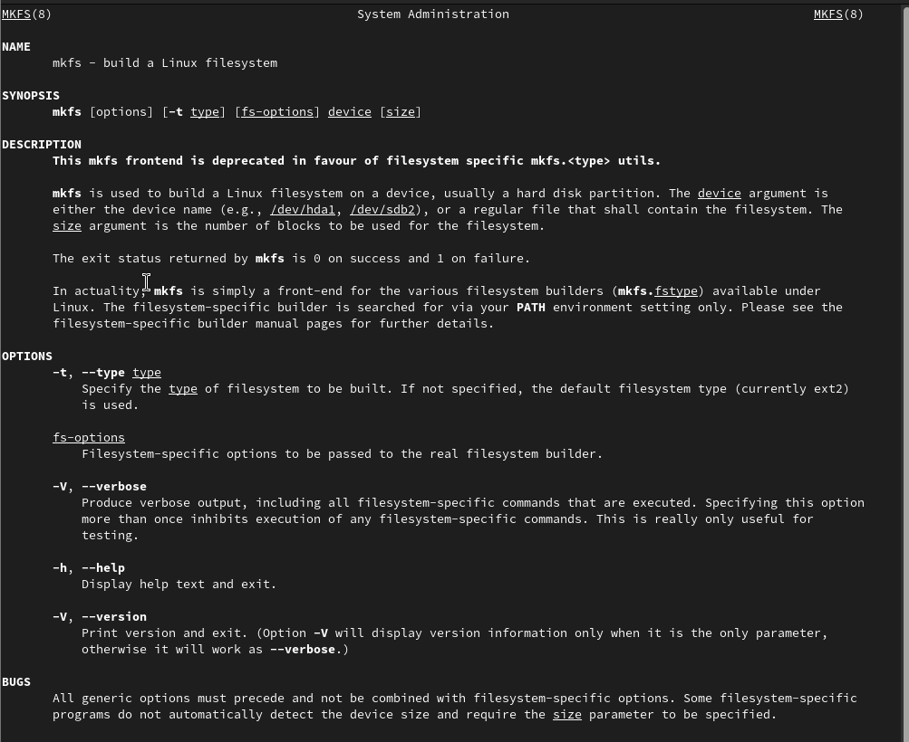{ #fig:030 width=70% }

- mkfs используется для создания файловой системы Linux на некотором устройстве, обычно в разделе жёсткого диска. В качестве аргумента filesys для файловой системы может выступать или название устройства (например, /dev/hda1, /dev/sdb2) или точка монтирования (например, /, /usr, /home).

 **31**

Прочитаю man по команде kill(рис. [-@fig:031])

{ #fig:031 width=70% }

- Команда Kill посылает указанный сигнал указанному процессу. Если не указано ни одного сигнала, посылается сигнал SIGTERM. Сигнал SIGTERM завершает лишь те процессы, которые не обрабатывают его приход. Для других процессов может быть необходимым послать сигнал SIGKILL, поскольку этот сигнал перехватить невозможно.

# Вывод

 Входе лабораторной работы я ознакомился с файловой системой Linux, её структурой, именами и содержанием каталогов. Приобрел практические навыки по применению команд для работы с файлами и каталогами.