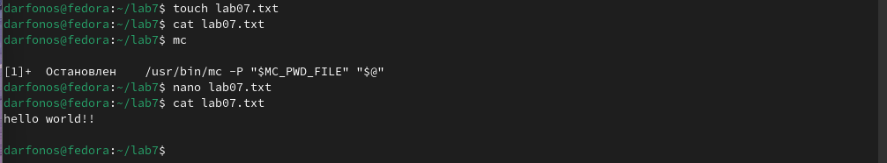
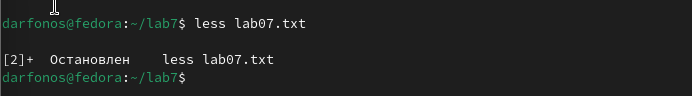
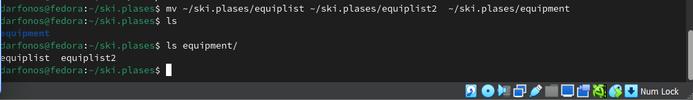
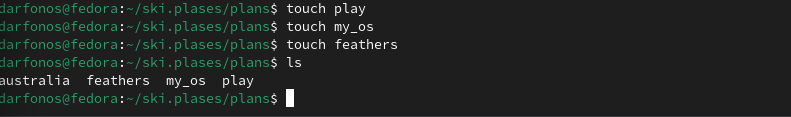

---
## Front matter
lang: ru-RU
title: Структура научной презентации
subtitle: Лабораторная работа намер 8
author:
  - Арфонос Дмитрий.
institute:
  - Российский университет дружбы народов, Москва, Россия
date: 23 марта 2024

## i18n babel
babel-lang: russian
babel-otherlangs: english

## Formatting pdf
toc: false
toc-title: Содержание
slide_level: 2
aspectratio: 169
section-titles: true
theme: metropolis
header-includes:
 - \metroset{progressbar=frametitle,sectionpage=progressbar,numbering=fraction}
 - '\makeatletter'
 - '\beamer@ignorenonframefalse'
 - '\makeatother'
---

# Информация

## студент

:::::::::::::: {.columns align=center}
::: {.column width="70%"}

  * Арфонос Дмитрий
  * НММ-03-23
  * студент
  * Российский университет дружбы народов
  * <https://github.com/dimaarfonos/study_2022-2023_os-intro/tree/master/labs>

:::
::: {.column width="30%"}

# 
-  Цель работы

Ознакомление с инструментами поиска файлов и фильтрации текстовых данных.
Приобретение практических навыков: по управлению процессами (и заданиями), по
проверке использования диска и обслуживанию файловых систем

***

# 
Выполнение лабораторной работы

#
Осуществляю вход в систему, используя соответствующее имя пользователя.

 #
Записываю в файл file.txt названия файлов, содержащихся в каталоге /etc.

#
Дописываю в этот же файл названия файлов, содержащихся в вашем домашнем каталоге. 

#
Вывожу имена всех файлов из file.txt, имеющих расширение .conf

#
После чего записываю их в новый текстовой файл conf.txt.( 

#
Запустил в фоновом режиме процесс, который будет записывать в файл ~/logfile файлы, имена которых начинаются с log.

#
Определяю идентификатор процесса gedit, используя команду ps, конвейер и фильтр grep.

#
Завершаю работу gedit с помощью команды kill.

### Вывод

В ходе работы я ознакомился с инструментами поиска файлов и фильтрации текстовых данных.