---
## Front matter
title: "Отчёт по лабораторной работе № 8"
subtitle: "Простейший вариант"
author: "Арфонос Дмитрий"

## Generic otions
lang: ru-RU
toc-title: "Содержание"

## Bibliography
bibliography: bib/cite.bib
csl: pandoc/csl/gost-r-7-0-5-2008-numeric.csl

## Pdf output format
toc: true # Table of contents
toc-depth: 2
lof: true # List of figures
fontsize: 12pt
linestretch: 1.5
papersize: a4
documentclass: scrreprt
## I18n polyglossia
polyglossia-lang:
  name: russian
  options:
	- spelling=modern
	- babelshorthands=true
polyglossia-otherlangs:
  name: english
## I18n babel
babel-lang: russian
babel-otherlangs: english
## Fonts
mainfont: PT Serif
romanfont: PT Serif
sansfont: PT Sans
monofont: PT Mono
mainfontoptions: Ligatures=TeX
romanfontoptions: Ligatures=TeX
sansfontoptions: Ligatures=TeX,Scale=MatchLowercase
monofontoptions: Scale=MatchLowercase,Scale=0.9
## Biblatex
biblatex: true
biblio-style: "gost-numeric"
biblatexoptions:
  - parentracker=true
  - backend=biber
  - hyperref=auto
  - language=auto
  - autolang=other*
  - citestyle=gost-numeric
## Pandoc-crossref LaTeX customization
figureTitle: "Рис."
listingTitle: "Листинг"
lofTitle: "Список иллюстраций"
lolTitle: "Листинги"
## Misc options
indent: true
header-includes:
  - \usepackage{indentfirst}
  - \usepackage{float} # keep figures where there are in the text
  - \floatplacement{figure}{H} # keep figures where there are in the text
---

# Цель работы

Ознакомление с инструментами поиска файлов и фильтрации текстовых данных.
Приобретение практических навыков: по управлению процессами (и заданиями), по
проверке использования диска и обслуживанию файловых систем

***

# Выполнение лабораторной работы

 **1**
Осуществляю вход в систему, используя соответствующее имя пользователя.
 (рис. [-@fig:001])

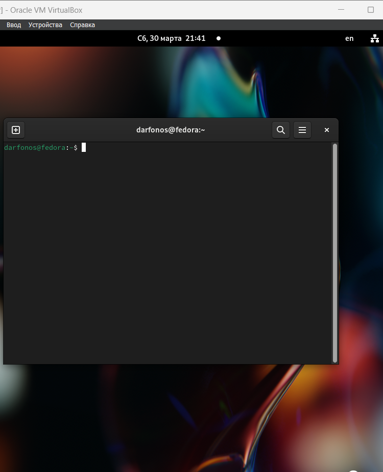{  #fig:001 width=70%  }

 **2**

Записываю в файл file.txt названия файлов, содержащихся в каталоге /etc.(рис. [-@fig:002])

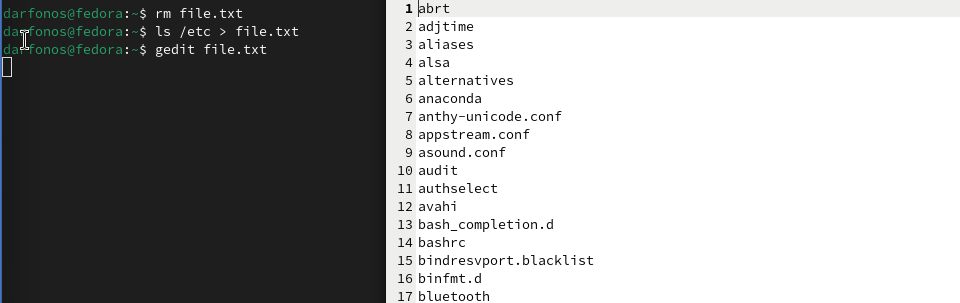{  #fig:002 width=70%  }

 **3**
Дописываю в этот же файл названия файлов, содержащихся в вашем домашнем каталоге. (рис. [-@fig:003])

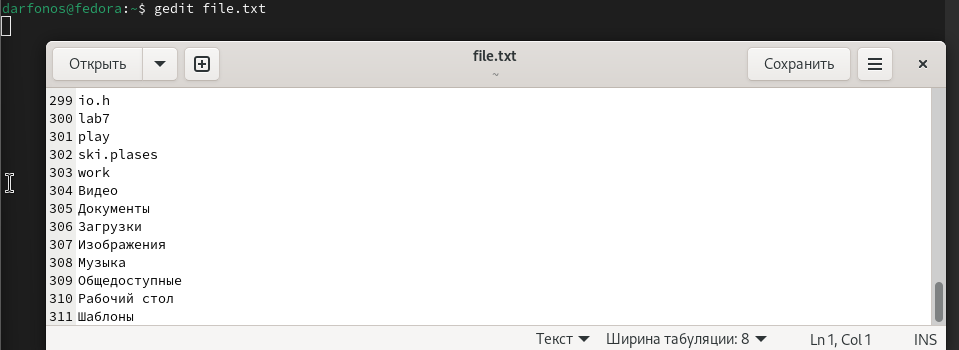{ #fig:003 width=70% }

 **4**
Вывожу имена всех файлов из file.txt, имеющих расширение .conf(рис. [-@fig:004])

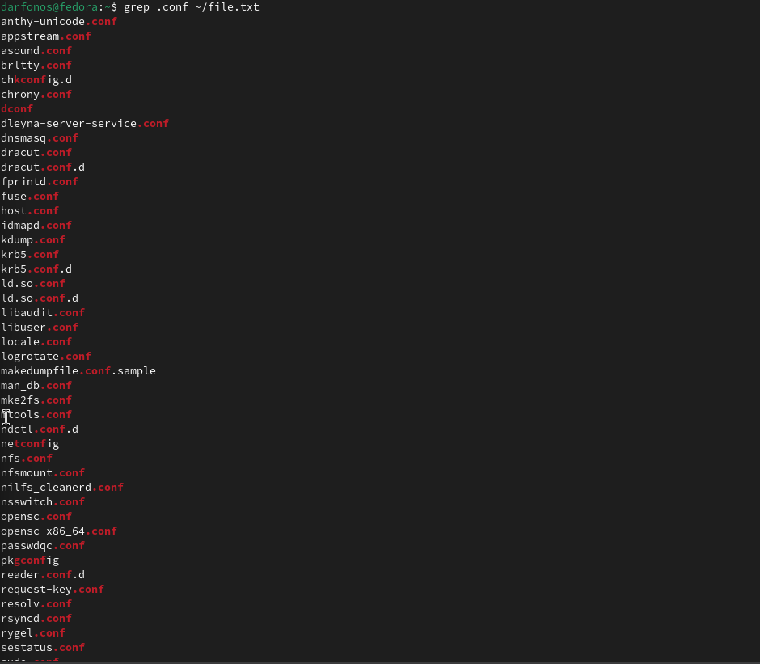{ #fig:004 width=70% }

Да, есть!

 **5**
После чего записываю их в новый текстовой файл conf.txt.(рис. [-@fig:005])
 
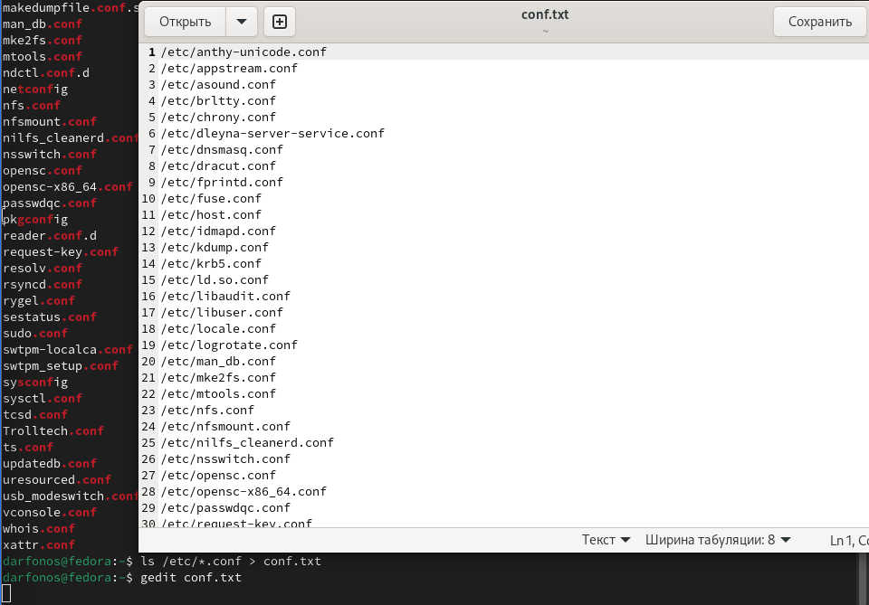{ #fig:005 width=70% }

 **6**
Определяю, какие файлы в вашем домашнем каталоге имеют имена, начинавшиеся с символа c (рис. [-@fig:006])

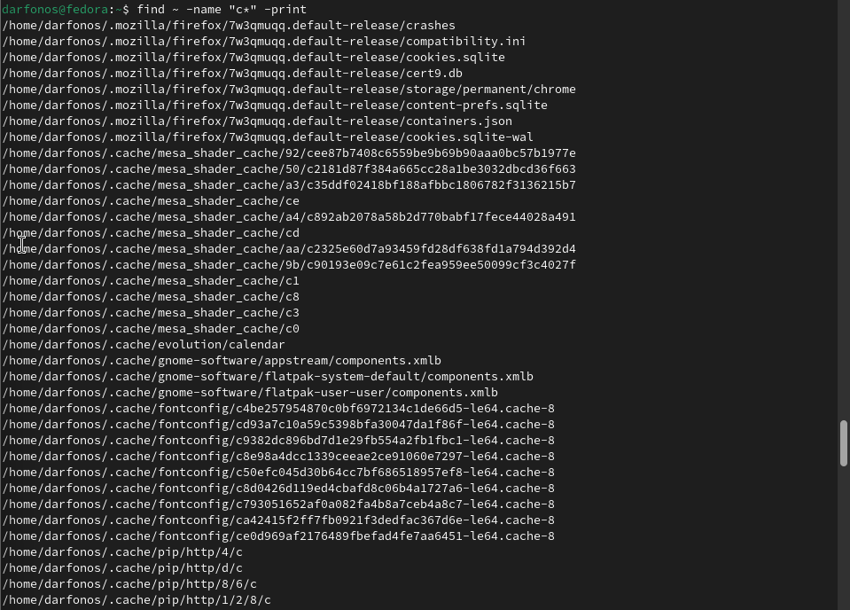{ #fig:006 width=70% }

 **7**
Вывожу на экран имена файлов из каталога /etc, начинающиеся
с символа h.(рис. [-@fig:007])

{ #fig:007 width=70% }

 **8**
Запустил в фоновом режиме процесс, который будет записывать в файл ~/logfile файлы, имена которых начинаются с log.(рис. [-@fig:008])

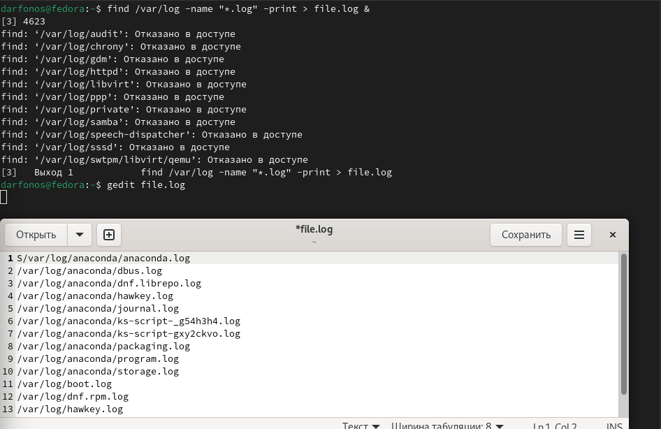{ #fig:008 width=70% }

 **9**

Удаляю файл ~/logfile.(рис. [-@fig:009])

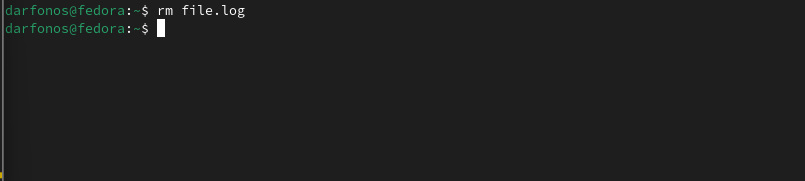{ #fig:009 width=70% }

 **10**

Запускаю из консоли в фоновом режиме редактор gedit.(рис. [-@fig:010])

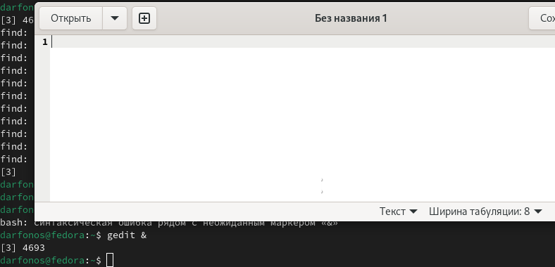{ #fig:010 width=70% }

 **11**

Определяю идентификатор процесса gedit, используя команду ps, конвейер и фильтр grep.(рис. [-@fig:011])

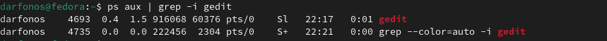{ #fig:011 width=70% }

 **12**

Прочел справку (man) команды kill(рис. [-@fig:012])

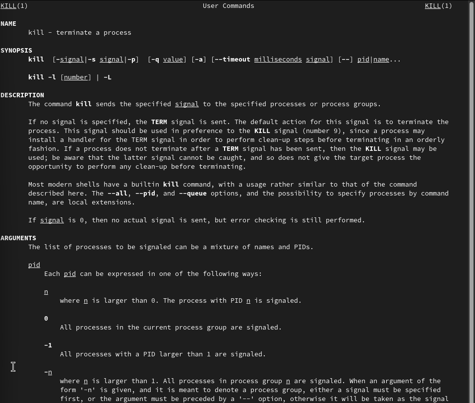{ #fig:012 width=70% }

 **13**

Завершаю работу gedit с помощью команды kill.

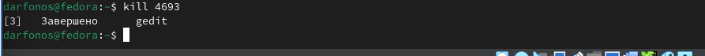{}

 **14**

Выполняю команды df и du, предварительно получив более подробную информацию об этих командах, с помощью команды man.(рис. [-@fig:013])

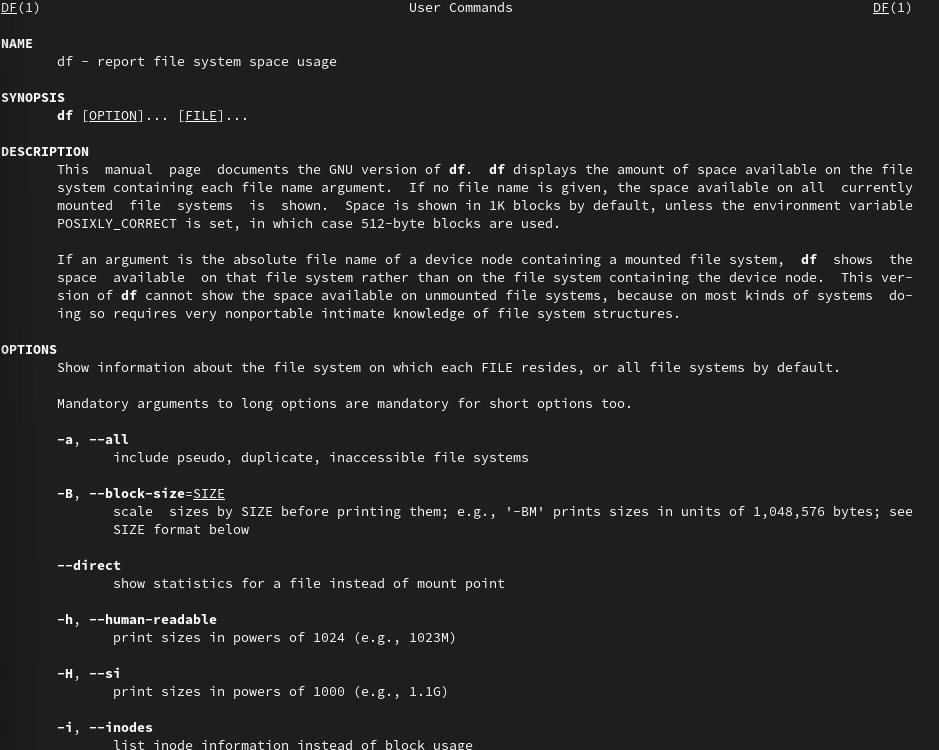{ #fig:013 width=70% }

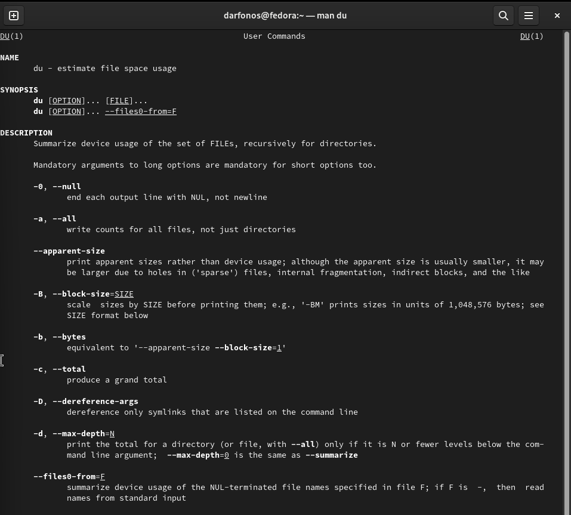{ width=70% }

 **14**

Воспользовавшись справкой команды find, вывел имена всех директорий, имеющихся в вашем домашнем каталоге.(рис. [-@fig:015])

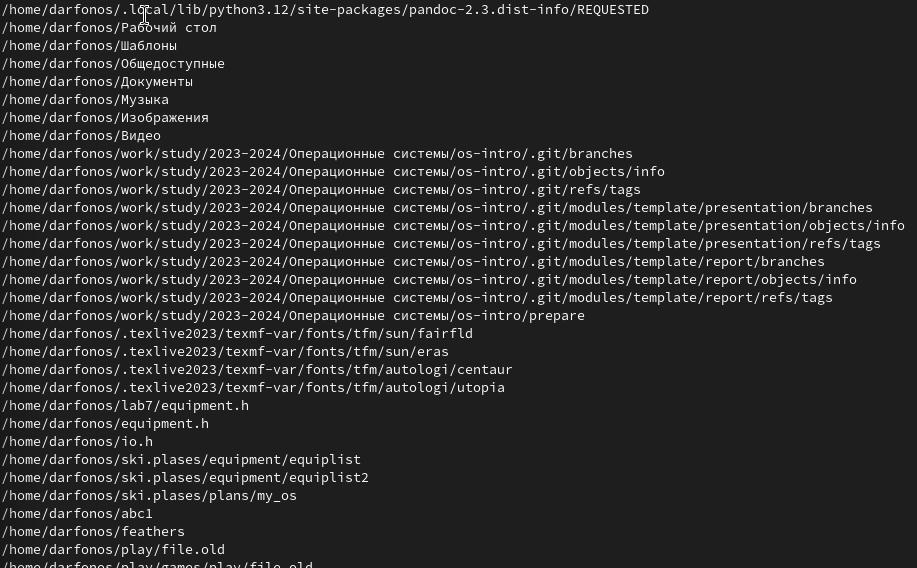{ #fig:015 width=70% }

# Вывод

В ходе работы я ознакомился с инструментами поиска файлов и фильтрации текстовых данных.

