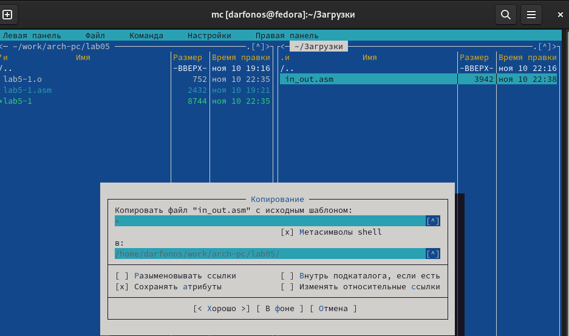
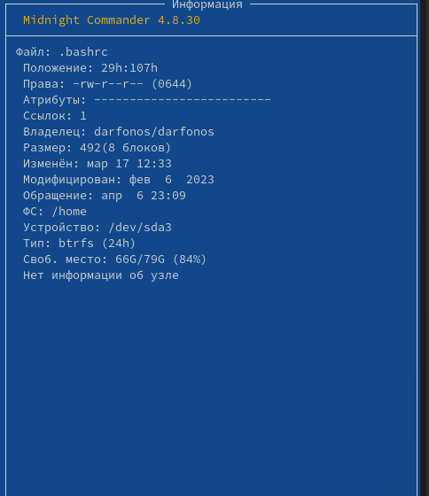
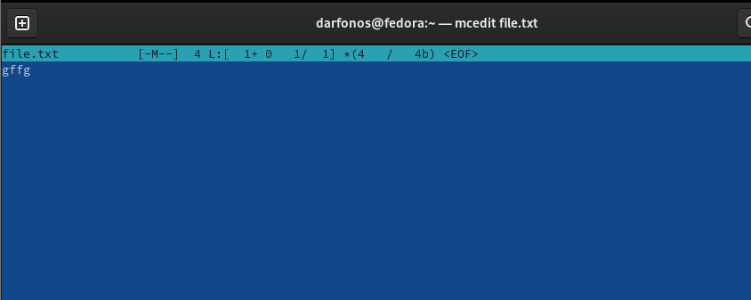

---
## Front matter
lang: ru-RU
title: Структура научной презентации
subtitle: Лабораторная работа намер 9
author:
  - Арфонос Дмитрий.
institute:
  - Российский университет дружбы народов, Москва, Россия
date: 23 марта 2024

## i18n babel
babel-lang: russian
babel-otherlangs: english

## Formatting pdf
toc: false
toc-title: Содержание
slide_level: 2
aspectratio: 169
section-titles: true
theme: metropolis
header-includes:
 - \metroset{progressbar=frametitle,sectionpage=progressbar,numbering=fraction}
 - '\makeatletter'
 - '\beamer@ignorenonframefalse'
 - '\makeatother'
---

# Информация

## студент

:::::::::::::: {.columns align=center}
::: {.column width="70%"}

  * Арфонос Дмитрий
  * НММ-03-23
  * студент
  * Российский университет дружбы народов
  * <https://github.com/dimaarfonos/study_2022-2023_os-intro/tree/master/labs>

:::
::: {.column width="30%"}

# 
-  Цель работы

Освоение основных возможностей командной оболочки Midnight Commander. Приобретение навыков практической работы по просмотру каталогов и файлов; манипуляций
с ними.

***

# 
Выполнение лабораторной работы

#
Запущу из командной строки mc, изучите его структуру и меню.

 #
Выполню несколько операций в mc, используя управляющие клавиши

#
. Выполню основные команды меню левой (или правой) панели

#
Создаю текстовой файл text.txt. Открою этот файл с помощью встроенного в mc редактора

#
Редактирую текст используя команды

### Вывод

В ходе работы я ознакомился с основными возможностми командной оболочки Midnight Commander. 
