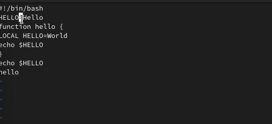
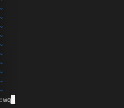

---
## Front matter
title: "Отчёт по лабораторной работе № 10"
subtitle: "Простейший вариант"
author: "Арфонос Дмитрий"

## Generic otions
lang: ru-RU
toc-title: "Содержание"

## Bibliography
bibliography: bib/cite.bib
csl: pandoc/csl/gost-r-7-0-5-2008-numeric.csl

## Pdf output format
toc: true # Table of contents
toc-depth: 2
lof: true # List of figures
fontsize: 12pt
linestretch: 1.5
papersize: a4
documentclass: scrreprt
## I18n polyglossia
polyglossia-lang:
  name: russian
  options:
	- spelling=modern
	- babelshorthands=true
polyglossia-otherlangs:
  name: english
## I18n babel
babel-lang: russian
babel-otherlangs: english
## Fonts
mainfont: PT Serif
romanfont: PT Serif
sansfont: PT Sans
monofont: PT Mono
mainfontoptions: Ligatures=TeX
romanfontoptions: Ligatures=TeX
sansfontoptions: Ligatures=TeX,Scale=MatchLowercase
monofontoptions: Scale=MatchLowercase,Scale=0.9
## Biblatex
biblatex: true
biblio-style: "gost-numeric"
biblatexoptions:
  - parentracker=true
  - backend=biber
  - hyperref=auto
  - language=auto
  - autolang=other*
  - citestyle=gost-numeric
## Pandoc-crossref LaTeX customization
figureTitle: "Рис."
listingTitle: "Листинг"
lofTitle: "Список иллюстраций"
lolTitle: "Листинги"
## Misc options
indent: true
header-includes:
  - \usepackage{indentfirst}
  - \usepackage{float} # keep figures where there are in the text
  - \floatplacement{figure}{H} # keep figures where there are in the text
---

# Цель работы

Познакомиться с операционной системой Linux. Получить практические навыки работы с редактором vi, установленным по умолчанию практически во всех дистрибутивах

***

# Выполнение лабораторной работы

 **1**
Создаю каталог с именем ~/work/os/lab06 и перехожу в неё.
 (рис. [-@fig:001])

{  #fig:001 width=70%  }

 **2**

Создаю файл для работы с редактором vi (рис. [-@fig:002])

{  #fig:002 width=70%  }

 **3**
Открываю файл и вставляю в нее текст.(рис. [-@fig:003])

{ #fig:003 width=70% }

 **4**
Сохраняю изменения и закрываю файл, делаю ее исполняемым.
(рис. [-@fig:004])

{ #fig:004 width=70% }

 **5**
 Вызываю vi на редактирование файла
(рис. [-@fig:005])
 
{ #fig:005 width=70% }

 **6**
Перехожу в режим вставки и заменяю в 3 строке Hell на HELLO.(рис. [-@fig:006])

{ #fig:006 width=70% }

 **7**
Перехожу в режим вставки и заменяю в 4 строке LOCAL на local.(рис. [-@fig:007])

{ #fig:007 width=70% }

 **8**
Вставляю в последней строке строку, содержащую
следующий текст: echo $HELLO(рис. [-@fig:008])

{ #fig:008 width=70% }

 **9**
Удаляю последнюю строку(рис. [-@fig:009])

{ #fig:009 width=70% }

 **10**
Сохраняю все изменения и выхожу из редактора(рис. [-@fig:0010])

{ #fig:010 width=70% }

# Вывод

В ходе работы я ознакомился с операционной системой Linux. Получил практические навыки работы с редактором vi, установленным по умолчанию практически во всех дистрибутивах.

