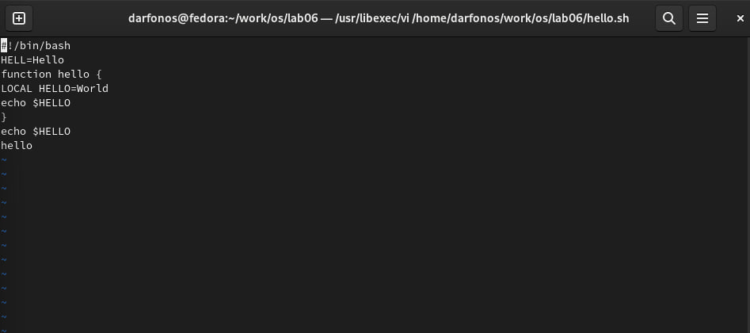

---
## Front matter
lang: ru-RU
title: Структура научной презентации
subtitle: Лабораторная работа намер 10
author:
  - Арфонос Дмитрий.
institute:
  - Российский университет дружбы народов, Москва, Россия
date: 23 марта 2024

## i18n babel
babel-lang: russian
babel-otherlangs: english

## Formatting pdf
toc: false
toc-title: Содержание
slide_level: 2
aspectratio: 169
section-titles: true
theme: metropolis
header-includes:
 - \metroset{progressbar=frametitle,sectionpage=progressbar,numbering=fraction}
 - '\makeatletter'
 - '\beamer@ignorenonframefalse'
 - '\makeatother'
---

# Информация

## студент

:::::::::::::: {.columns align=center}
::: {.column width="70%"}

  * Арфонос Дмитрий
  * НММ-03-23
  * студент
  * Российский университет дружбы народов
  * <https://github.com/dimaarfonos/study_2022-2023_os-intro/tree/master/labs>

:::
::: {.column width="30%"}

# 
-  Цель работы

Познакомиться с операционной системой Linux. Получить практические навыки работы с редактором vi, установленным по умолчанию практически во всех дистрибутивах

***

# 
Выполнение лабораторной работы

# 
Создаю каталог с именем ~/work/os/lab06 и перехожу в неё.

 #
Создаю файл для работы с редактором vi

#
Открываю файл и вставляю в нее текст.

#
Сохраняю изменения и закрываю файл, делаю ее исполняемым.

#
Редактирую текст используя режим вставки: Перехожу в режим вставки и заменяю в 4 строке LOCAL на local

#
Сохраняю все изменения и выхожу из редактора

### Вывод

В ходе работы я ознакомился с операционной системой Linux. Получил практические навыки работы с редактором vi, установленным по умолчанию практически во всех дистрибутивах.
